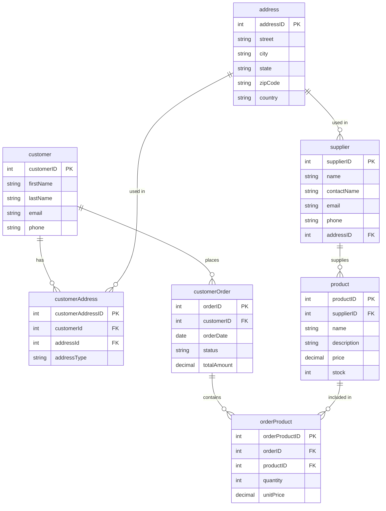
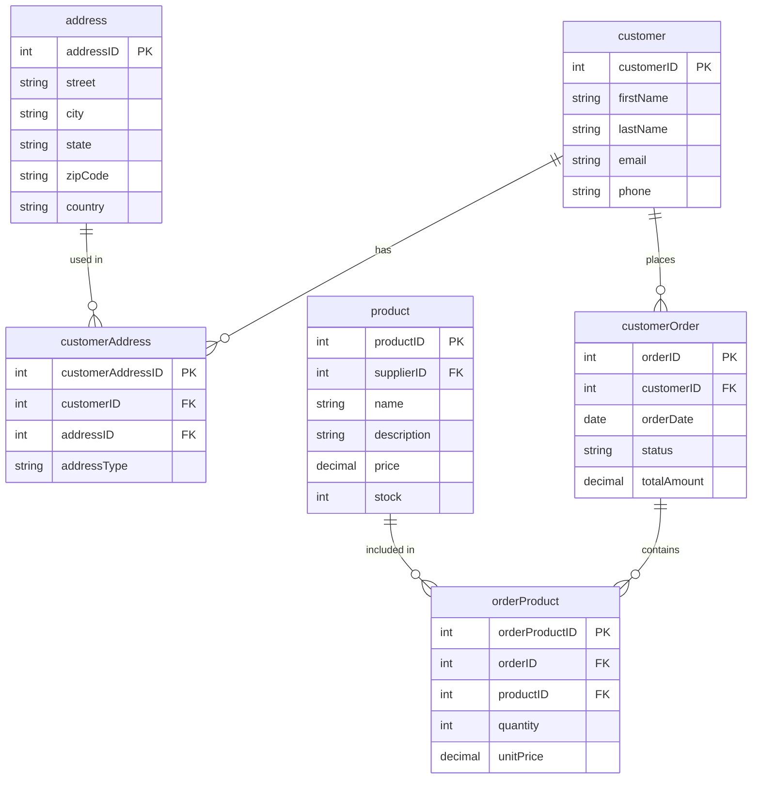
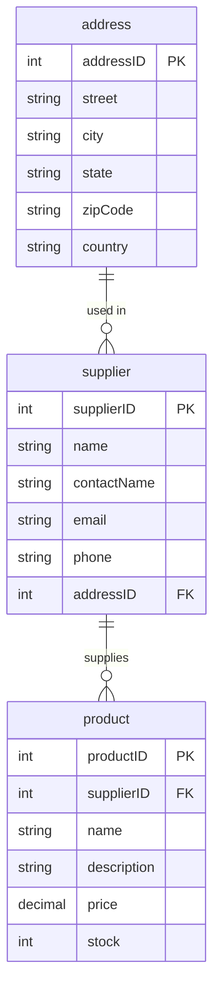

# Distribución de datos
_______________________________

📌 Vertical Fragmentation


**Instructions**. 

For this exercise, the **salesBD** database is used to build the requested fragments.
It uses the [database backup](https://github.com/edcrvl/courses/edit/main/databases/salesBD_bk.sql)  to build the two vertical fragments.

To restore the backup, use the following process.
1. Log in to the MySQL server.
```
   $ mysql -u root -p
```
2. Create a new database named **salesDB**.
```sql
   mysql> CREATE DATABASE salesDB;
```
3. To restore the salesBD_bk.sql file in the salesDB database, you must exit MySQL and execute the following command:
```
   $ mysql -u root -p salesDB < salesBD_bk.sql
```
4. Verify that the restoration process was complete. Generate the general statistics report with the following script:
```sql
    mysql> SELECT   t.TABLE_NAME                            AS `Tabla`,
                    t.TABLE_ROWS                            AS `Registros`,
                    t.AVG_ROW_LENGTH                        AS `Tamaño fila (bytes)`,
                    ROUND(t.DATA_LENGTH / 1024 / 1024, 2)   AS `Datos (MB)`,
                    ROUND(t.INDEX_LENGTH / 1024 / 1024, 2)  AS `Índices (MB)`,
                    ROUND((t.DATA_LENGTH + t.INDEX_LENGTH) / 1024 / 1024, 2) AS `Total (MB)`
            FROM
                information_schema.TABLES t
            WHERE
                t.TABLE_SCHEMA = DATABASE()
              AND t.TABLE_TYPE = 'BASE TABLE'
            ORDER BY
                t.TABLE_ROWS DESC;
```
The result should be identical to the following table:

| Table          | Tuples | Tuple size (bytes) | Data (MB) | Index (MB) | Total (MB) |
|-----------------|--------|--------------------|-----------|------------|------------|
| customeraddress | 110    | 148                | 0.02      | 0.03       |       0.05 |
| customerorder   | 101    | 162                | 0.02      | 0.02       |       0.03 |
| address         | 100    | 163                | 0.02      | 0.00       |       0.02 |
| customer        | 100    | 163                | 0.02      | 0.02       |       0.03 |
| orderproduct    | 100    | 163                | 0.02      | 0.03       |       0.05 |
| product         | 100    | 163                | 0.02      | 0.02       |       0.03 |
| supplier        | 100    | 163                | 0.02      | 0.02       |       0.03 |

The restored backup has a design error in the **customer** table.
Obtain the schema definition of the customer table with the following command:
```sql
    mysql> DESC customer;
```
The result is as follows:

| Field      | Type         | Null | Key | Default | Extra          |
|------------|--------------|------|-----|---------|----------------|
| customerID | int          | NO   | PRI | NULL    | auto_increment |
| name       | varchar(100) | YES  |     | NULL    |                |
| phone      | varchar(20)  | YES  |     | NULL    |                |
| email      | varchar(100) | YES  |     | NULL    |                |
| addressID  | int          | YES  | MUL | NULL    |                |

The _addressID_ attribute must be deleted. 
To do this, execute the following statement to remove the constraint _customer_ibfk_1_ linked to the addressID attribute.
```sql
    mysql> ALTER TABLE customer DROP CONSTRAINT customer_ibfk_1;
```

Now, you can delete the _addressID_ column with the following script:
```sql
    mysql> ALTER TABLE customer DROP COLUMN addressID;
```

These lab is based on the following relational model.



# Vertical fragment: _customerDB_

## 1. 🧠 Build a vertical fragment that contains all customer data.

### ✅ Relational model of vertical fragment customerDB.



### ✅ SQL scripts to create a fragment customerDB in MySQL.

To create the database **customerDB** use following command:

```sql
    mysql> CREATE DATABASE customerDB;
```
To create the database tables, you must use the following commands:

```sql
    mysql>
            CREATE TABLE address (
                addressId   INT             NOT NULL AUTO_INCREMENT,
                street      VARCHAR(255)    NOT NULL,
                city        VARCHAR(100)    NOT NULL,
                state       VARCHAR(100)    NOT NULL,
                zipCode     VARCHAR(20)     NOT NULL,
                country     VARCHAR(100)    NOT NULL,
                CONSTRAINT pk_address PRIMARY KEY (addressId)
            );
            
            CREATE TABLE customer (
                customerId  INT             NOT NULL AUTO_INCREMENT,
                firstName   VARCHAR(100)    NOT NULL,
                lastName    VARCHAR(100)    NOT NULL,
                email       VARCHAR(255)    NOT NULL,
                phone       VARCHAR(20),
                CONSTRAINT pk_customer PRIMARY KEY (customerId),
                CONSTRAINT uq_customer_email UNIQUE (email)
            );
            
            CREATE TABLE customerAddress (
                customerAddressId   INT             NOT NULL AUTO_INCREMENT,
                customerId          INT             NOT NULL,
                addressId           INT             NOT NULL,
                addressType         VARCHAR(50)     NOT NULL,
                CONSTRAINT pk_customerAddress   PRIMARY KEY (customerAddressId),
                CONSTRAINT fk_ca_customer       FOREIGN KEY (customerId) 
                    REFERENCES customer (customerId),
                CONSTRAINT fk_ca_address FOREIGN KEY (addressId) 
                    REFERENCES address (addressId)
            );
            
            CREATE TABLE product (
                productId   INT             NOT NULL AUTO_INCREMENT,
                supplierId  INT,
                name        VARCHAR(255)    NOT NULL,
                description TEXT,
                price       DECIMAL(10, 2)  NOT NULL,
                stock       INT             NOT NULL DEFAULT 0,
                CONSTRAINT pk_product   PRIMARY KEY (productId)
            );
            
            CREATE TABLE customerOrder (
                orderId      INT             NOT NULL AUTO_INCREMENT,
                customerId   INT             NOT NULL,
                orderDate    DATE            NOT NULL,
                status       VARCHAR(50)     NOT NULL DEFAULT 'pending',
                totalAmount  DECIMAL(12, 2)  NOT NULL DEFAULT 0.00,
                CONSTRAINT pk_customerOrder PRIMARY KEY (orderId),
                CONSTRAINT fk_co_customer   FOREIGN KEY (customerId) 
                    REFERENCES customer (customerId)
            );
            
            CREATE TABLE orderProduct (
                orderProductId  INT             NOT NULL AUTO_INCREMENT,
                orderId         INT             NOT NULL,
                productId       INT             NOT NULL,
                quantity        INT             NOT NULL,
                unitPrice       DECIMAL(10, 2)  NOT NULL,
                CONSTRAINT pk_orderProduct  PRIMARY KEY (orderProductId),
                CONSTRAINT fk_op_order      FOREIGN KEY (orderId) 
                    REFERENCES customerOrder (orderId),
                CONSTRAINT fk_op_product    FOREIGN KEY (productId)
                    REFERENCES product (productId)
);
```

### 📌 Scripts for downloading data from the **salesBD** database in CSV format.

From the command line, we can extract information from a table in a MySQL database and store the content in a plain text file. 
In the following example, data is extracted from the customer table in the salesDB database and saved in the customer.txt file.
```
    $ mysql -u root -p salesDB -e "select * from customer" > customer.txt
```

Another option is to download the table content into a file in CSV format 
with the _SELECT INTO OUTFILE_ statement as follows:

```sql
   mysql> 
          SELECT customerID, firstName, lastName, phone, email
            FROM customer
            INTO OUTFILE '/tmp/customer.csv'
            FIELDS TERMINATED BY ','
            ENCLOSED BY '"'
            LINES TERMINATED BY '\n';
```

### 📌 Scripts for loading data from the CSV format files to database customerDB.

```sql
   mysql>
          LOAD DATA LOCAL INFILE '/tmp/customer.csv' 
            INTO TABLE customer
            FIELDS TERMINATED BY ','
            ENCLOSED BY '"'
            LINES TERMINATED BY '\n';
```

**TODO**  To verify the result of the ETL process, run the script to obtain statistics for the custormerDB fragment.
**Statistics table**

# Vertical fragment: _supplierDB_

## 2. 🧠 Build a vertical fragment that contains all supplier data.

### ✅ Relational model of vertical fragment supplierDB.



### 📌 Scripts for downloading data from the **salesBD** database in CSV format.

Extract the data from the supplier table using the _SELECT INTO OUTFILE_ command from the MySQL server, as follows:

```sql
   mysql> 
          SELECT supplierID, name, contactName, email, phone, addressID
            FROM supplier
            INTO OUTFILE '/tmp/supplier.csv'
            FIELDS TERMINATED BY ','
            ENCLOSED BY '"'
            LINES TERMINATED BY '\n';
```

### 📌 Scripts for loading data from the CSV format files to database customerDB.

```sql
   mysql>
          LOAD DATA LOCAL INFILE '/tmp/supplier.csv' 
            INTO TABLE supplier
            FIELDS TERMINATED BY ','
            ENCLOSED BY '"'
            LINES TERMINATED BY '\n';
```

**TODO**  To verify the result of the ETL process, run the script to obtain statistics for the custormerDB fragment.
**Statistics table**

🚀 Tell me what you want, how you want it, and we'll put it together. 💪 


