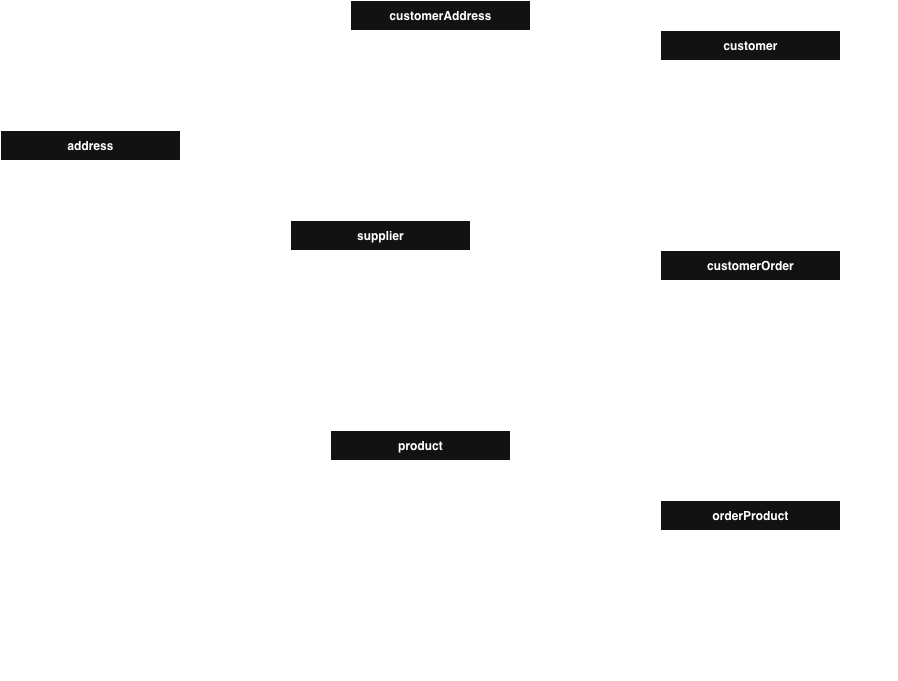
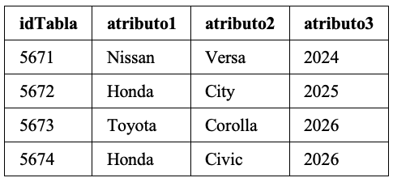

# Bloque 4. *Consultas SQL nivel intermedio*
_______________________________

📌 Nivel: Intermedio

📌 Enfoque: JOIN, GROUP BY, HAVING, funciones de agregación 


**Instrucciones**. Utilizar la base de datos *salesbd* para construir las consultas. 
En la siguiente imagen se presenta el modelo relacional de la base de datos.
Es indispensable que primero construyas la base de datos, las tablas e insertes datos de prueba (puedes utilizar la de la práctica 1).



Nota. Sigue el ejemplo para preparar tu entregable.

Ejemplo
---------------
0. Listado de todos las tuplas de la tabla mi_tabla con la condicion_1.
   
**Solución** ✅
```sql
   SELECT *
     FROM mi_tablas
    WHERE condicion_1
```

**Salida** 📌

OPCIÓN 1. Imagen con el resultado de la consulta. 



OPCIÓN 2. Tabla con el resultado de la consulta.

| idTabla | atributo1 | atributo2 | atributo3 | 
| --------- | --------- | --------- | --------- |
| 5671 | Nissan | Versa | 2024 |
| 5672 | Honda| City | 2025 | 
| 5673 | Toyota | Corolla | 2026 |  
| 5674 | Honda | Civic | 2026 | 


Consultas
---------------
1. *Total de pedidos por cliente*. Muestra el nombre del cliente y la cantidad total de pedidos que ha realizado.

   
**Solución** ✅

   TODO script SQL

**Salida** 📌

   TODO listado de atributos y tuplas
   
2. *Total gastado por cliente*. Obtén el nombre del cliente y el importe total gastado en todos sus pedidos.
   
**Solución** ✅

   TODO script SQL

**Salida** 📌

   TODO listado de atributos y tuplas
   
3. *Productos más caros por proveedor*. Muestra el proveedor y el precio máximo de los productos que suministra.
   
**Solución** ✅

   TODO script SQL

**Salida** 📌

   TODO listado de atributos y tuplas

4. *Pedidos con más de 3 productos*. Lista los pedidos cuyo total de unidades compradas sea mayor a 3.
   
**Solución** ✅

   TODO script SQL

**Salida** 📌

   TODO listado de atributos y tuplas
   
5. *Ventas totales por producto*. Muestra el nombre del producto y el total de unidades vendidas.
   
**Solución** ✅

   TODO script SQL

**Salida** 📌

   TODO listado de atributos y tuplas

6. *Clientes que han gastado más de $1,000.00*. Lista los clientes cuyo gasto total sea mayor a 1000.
   
**Solución** ✅

   TODO script SQL

**Salida** 📌

   TODO listado de atributos y tuplas

7. *Promedio de precio por tipo de producto*. Obtén el precio promedio de los productos por cada tipo.
   
**Solución** ✅

   TODO script SQL

**Salida** 📌

   TODO listado de atributos y tuplas

8. *Proveedores con más de 5 productos*. Muestra los proveedores que suministran más de 5 productos.

   
**Solución** ✅

   TODO script SQL

**Salida** 📌

   TODO listado de atributos y tuplas

9. *Pedidos con información del cliente*. Muestra el ID del pedido, la fecha y el nombre del cliente.
   
**Solución** ✅

   TODO script SQL

**Salida** 📌

   TODO listado de atributos y tuplas

10. *Clientes sin pedidos*. Lista los clientes que no han realizado ningún pedido.

**Solución** ✅

   TODO script SQL

**Salida** 📌

   TODO listado de atributos y tuplas


📘 Qué se refuerza en nivel intermedio

✔ Agregaciones (SUM, COUNT, AVG, MAX)

✔ Agrupación de datos

✔ Filtros con HAVING

✔ JOIN entre múltiples tablas

✔ Análisis de datos reales

Llegaste al final 🚀


