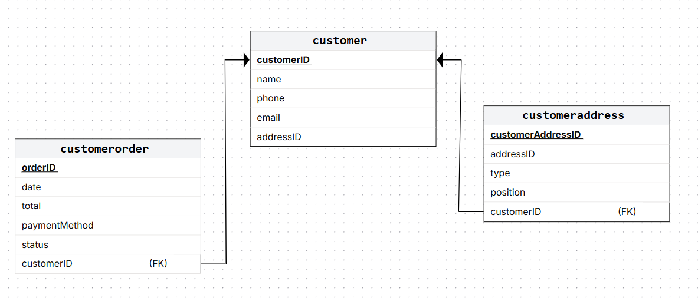

## *Distribución de datos*
_______________________________

📌 Fragmentación vertical
📌 Fragmentación horizontal 


**Instrucciones**. Para estos ejercicios se utiliza la base de datos *salesbd* para construir los fragmentos que se solicitan. 
Utiliza el [respaldo de la base de datos](https://github.com/edcrvl/courses/edit/main/databases/salesBD_bk.sql) para construir los fragmentos.

La práctica se basa en el modelo relacional de la base de datos base de datos *salesbd* que se prenta en el siguiente diagrama. 


Nota. Sigue el ejemplo para preparar tu entregable.

Ejemplo
---------------
0. Proceso para construir el fragmento 1 de la base de datos salesbd.
   
**Esquema del fragmento** ✅


**Script para crear fragmento** ✅

```sql
   SELECT *
     FROM mi_tablas
    WHERE condicion_1
```

**Scripts para descargar los datos de la base de datos salesbd.** 📌

```sql
   SELECT *
     FROM mi_tablas
    WHERE condicion_1
```

**Scripts para cargar los datos al fragmento 1.** 📌

```sql
   INSERT INTO mi_tablas
    FROM origen_1
```


Fragmentos verticales
------------------------
1. 🧠 *Fragmento customerDB*. Construye un fragmento vertical que contenga todos los datos de customer, pero sólo los de customer.
   
**Esquema del fragmento** ✅



**Script para crear fragmento** ✅

   ```sql
CREATE DATABASE IF NOT EXISTS customerDB;
USE customerDB;

CREATE TABLE customer (
    customerID INT(11) NOT NULL AUTO_INCREMENT,
    name VARCHAR(100) DEFAULT NULL,
    phone VARCHAR(20) DEFAULT NULL,
    email VARCHAR(100) DEFAULT NULL,
    addressID INT(11) DEFAULT NULL,
    PRIMARY KEY (customerID)
) ENGINE=InnoDB DEFAULT CHARSET=utf8;

CREATE TABLE customeraddress (
    customerAddressID INT(11) NOT NULL AUTO_INCREMENT,
    customerID INT(11) DEFAULT NULL,
    addressID INT(11) DEFAULT NULL,
    type VARCHAR(50) DEFAULT NULL,
    position INT(11) DEFAULT NULL,
    PRIMARY KEY (customerAddressID),
    KEY customerID (customerID),
    CONSTRAINT customeraddress_ibfk_1 FOREIGN KEY (customerID) REFERENCES customer (customerID)
) ENGINE=InnoDB DEFAULT CHARSET=utf8;

CREATE TABLE customerorder (
    orderID INT(11) NOT NULL AUTO_INCREMENT,
    customerID INT(11) DEFAULT NULL,
    date DATE DEFAULT NULL,
    total DECIMAL(10,2) DEFAULT NULL,
    paymentMethod VARCHAR(50) DEFAULT NULL,
    status VARCHAR(50) DEFAULT NULL,
    PRIMARY KEY (orderID),
    KEY customerID (customerID),
    CONSTRAINT customerorder_ibfk_1 FOREIGN KEY (customerID) REFERENCES customer (customerID)
) ENGINE=InnoDB DEFAULT CHARSET=utf8;
   ```

**Scripts para descargar los datos de la base de datos salesbd.** 📌

   ```sql
USE bk_salesbd;
-- Descargar customer
SELECT * 
INTO OUTFILE 'C:/ProgramData/MySQL/MySQL Server 8.0/Uploads/ExportacionesSalesDB/customer.csv'
FIELDS TERMINATED BY ';'
OPTIONALLY ENCLOSED BY '"'
LINES TERMINATED BY '\n'
FROM customer;

-- Descargar customerAddress
SELECT * 
INTO OUTFILE 'C:/ProgramData/MySQL/MySQL Server 8.0/Uploads/ExportacionesSalesDB/customerAddress.csv'
FIELDS TERMINATED BY ';'
OPTIONALLY ENCLOSED BY '"'
LINES TERMINATED BY '\n'
FROM customeraddress;


-- Descargar customerOrder
SELECT * 
INTO OUTFILE 'C:/ProgramData/MySQL/MySQL Server 8.0/Uploads/ExportacionesSalesDB/customerOrder.csv'
FIELDS TERMINATED BY ';'
OPTIONALLY ENCLOSED BY '"'
LINES TERMINATED BY '\n'
FROM customerorder;
   ```
**Scripts para cargar los datos al fragmento 1.** 📌

   ```sql
use customerDB;
-- Cargar customer
LOAD DATA INFILE 'C:/ProgramData/MySQL/MySQL Server 8.0/Uploads/ExportacionesSalesDB/customer.csv'
INTO TABLE customer
FIELDS TERMINATED BY ';'
OPTIONALLY ENCLOSED BY '"'
LINES TERMINATED BY '\n'
IGNORE 0 LINES; -- Si se hubieran descargado tambien las cabeceras seria 1 en ves de 0

-- Cargar customerAddress
LOAD DATA INFILE 'C:/ProgramData/MySQL/MySQL Server 8.0/Uploads/ExportacionesSalesDB/customerAddress.csv'
INTO TABLE customeraddress
FIELDS TERMINATED BY ';'
OPTIONALLY ENCLOSED BY '"'
LINES TERMINATED BY '\n'
IGNORE 0 LINES; -- Si se hubieran descargado tambien las cabeceras seria 1 en ves de 0

-- Cargar customerOrder
LOAD DATA INFILE 'C:/ProgramData/MySQL/MySQL Server 8.0/Uploads/ExportacionesSalesDB/customerOrder.csv'
INTO TABLE customerorder
FIELDS TERMINATED BY ';'
OPTIONALLY ENCLOSED BY '"'
LINES TERMINATED BY '\n'
IGNORE 0 LINES; -- Si se hubieran descargado tambien las cabeceras seria 1 en ves de 0
   ```
   
2. 🧠 *Fragmento supplierDB*. Construye un fragmento vertical que contenga todos los datos de supplier, pero sólo los de supplier.
   
**Esquema del fragmento** ✅

	TODO esquema

**Script para crear fragmento** ✅

   TODO script SQL

**Scripts para descargar los datos de la base de datos salesbd.** 📌

   TODO script SQL

**Scripts para cargar los datos al fragmento 1.** 📌

   TODO script SQL
   
Fragmentos horizontales
------------------------
3. 🧠 *Fragmento zona1DB*. Construye un fragmento horizontal que contenga todos los clientes con dirección en los estados CDMX e Hidalgo. Incluye toda la información de los clientes y su órdenes de compra.
   
**Esquema del fragmento** ✅

	TODO esquema

**Script para crear fragmento** ✅

   TODO script SQL

**Scripts para descargar los datos de la base de datos salesbd.** 📌

   TODO script SQL

**Scripts para cargar los datos al fragmento 1.** 📌

   TODO script SQL

   
4. 🧠 *Fragmento zona2DB*. Construye un fragmento horizontal que contenga todos los clientes con dirección en los estados estado3 y estado4. Incluye toda la información de los clientes y su órdenes de compra.
   
**Esquema del fragmento** ✅

	TODO esquema

**Script para crear fragmento** ✅

   TODO script SQL

**Scripts para descargar los datos de la base de datos salesbd.** 📌

   TODO script SQL

**Scripts para cargar los datos al fragmento 1.** 📌

   TODO script SQL

5. 🧠 *Fragmento zona3DB*. Construye un fragmento horizontal que contenga todos los clientes con dirección en los estados estado5 y estado6. Incluye toda la información de los clientes y su órdenes de compra.
   
**Esquema del fragmento** ✅

	TODO esquema

**Script para crear fragmento** ✅

   TODO script SQL

**Scripts para descargar los datos de la base de datos salesbd.** 📌

   TODO script SQL

**Scripts para cargar los datos al fragmento 1.** 📌

   TODO script SQL
📘 ¿Qué se refuerza?
✔ Lectura de esquemas
✔ Lógica de negocio
✔ Subconsultas
✔ Consultas tipo examen universitario / técnico

Dime qué quieres, cómo lo quieres y lo armamos 💪 🚀


