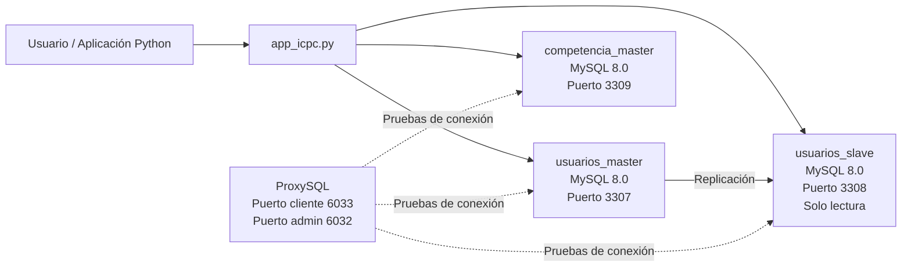
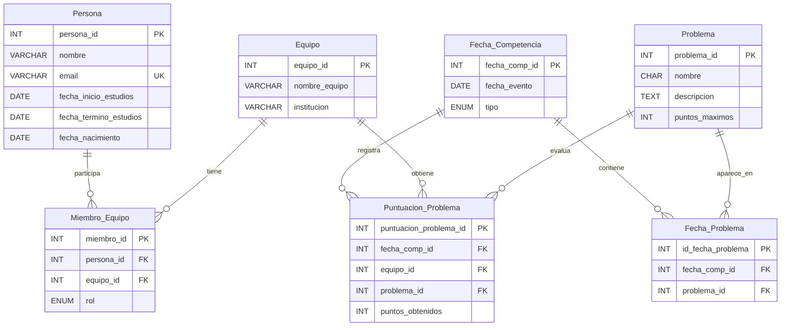
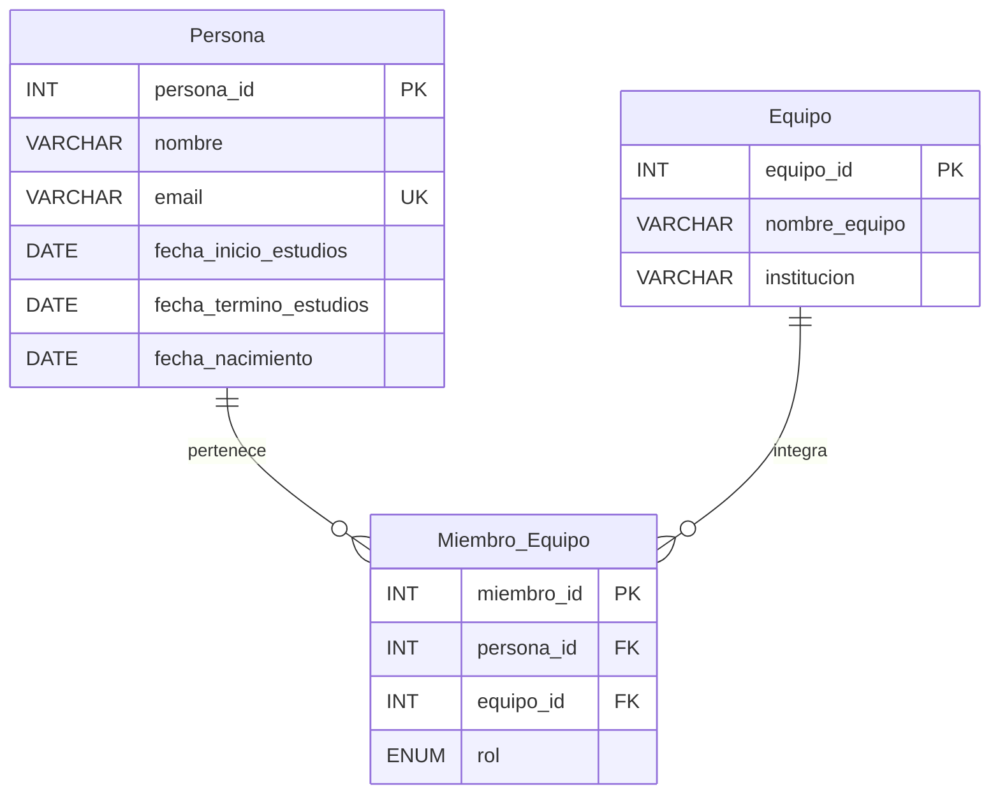
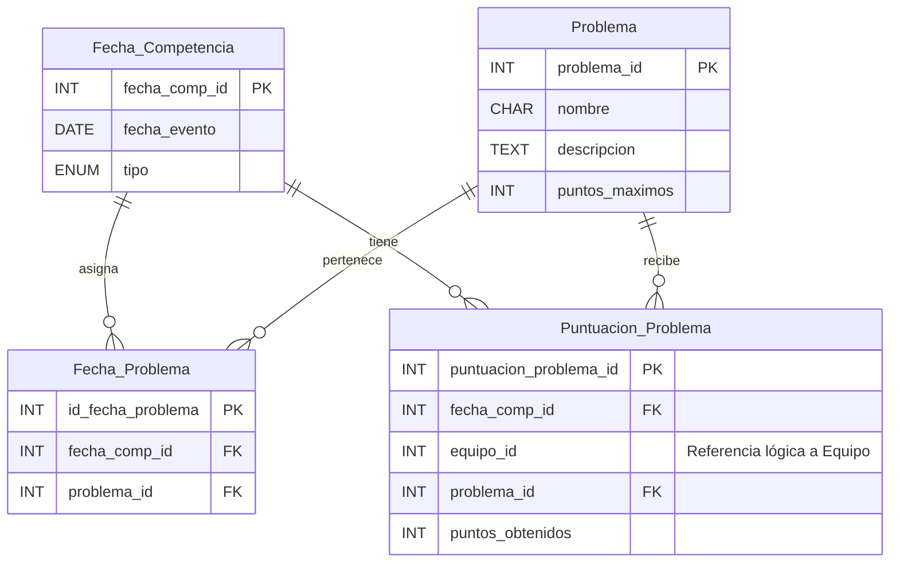
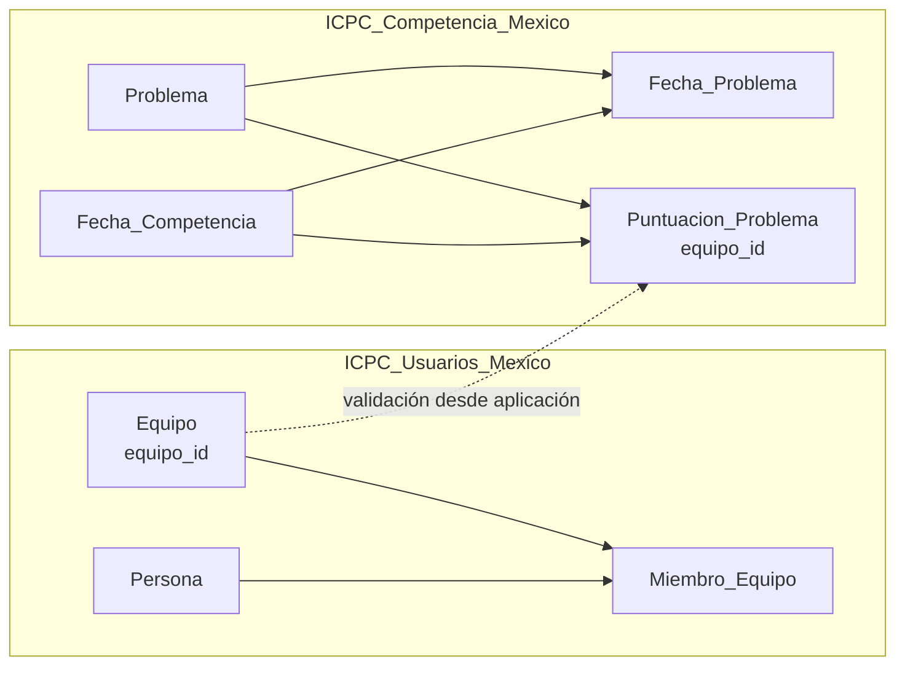
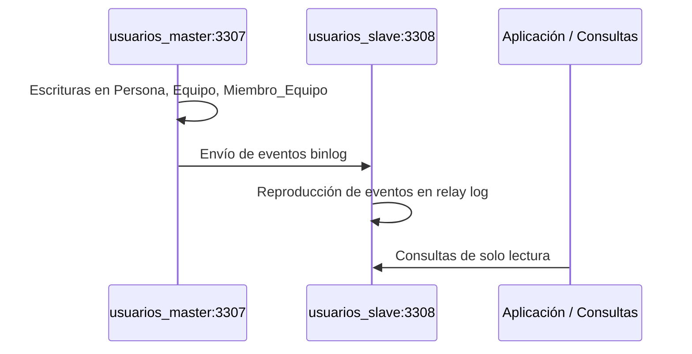
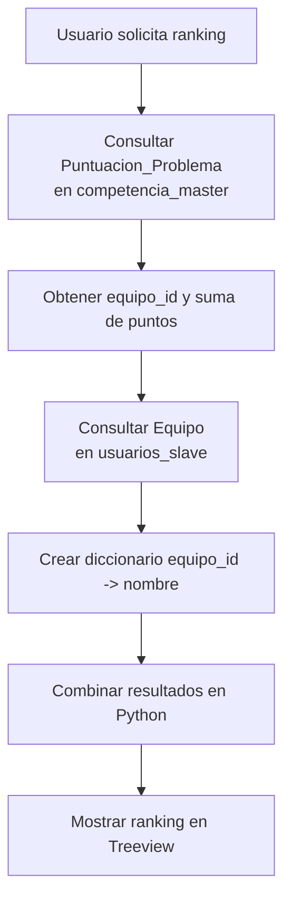

# Reporte de práctica  
# Implementación de una base de datos distribuida para ICPC México

**Alumnos:** Brandon Torres De Paz y Vladimir Islas Batalla
**Proyecto:** Sistema ICPC Distribuido  
**Tecnologías utilizadas:** MySQL 8.0, Docker, Docker Compose, ProxySQL, Python, Tkinter y PyMySQL  
**Fecha:** Mayo de 2026

---

## 1. Introducción

En esta práctica se desarrolló un sistema de base de datos distribuida para administrar información relacionada con una competencia tipo ICPC México. El proyecto inició con un prototipo unificado en MySQL local y posteriormente evolucionó hacia una arquitectura distribuida mediante contenedores Docker.

La solución se organizó en tres nodos principales: un maestro de usuarios, un esclavo de usuarios en modo solo lectura y un maestro de competencia. Además, se incorporó ProxySQL como capa de software para pruebas de conexión y se desarrolló una aplicación en Python con interfaz gráfica usando Tkinter.

El sistema permite registrar personas, equipos, miembros de equipo, fechas de competencia, problemas y puntuaciones. También permite consultar rankings combinando información de dos dominios distribuidos: usuarios y competencia.

---

## 2. Objetivos

### 2.1 Objetivo general

Implementar una arquitectura distribuida de base de datos utilizando MySQL, Docker y una aplicación cliente en Python para gestionar información de usuarios, equipos y competencias de ICPC México.

### 2.2 Objetivos específicos

- Diseñar un modelo relacional para el dominio de usuarios y competencia.
- Crear un prototipo unificado en MySQL local.
- Fragmentar la base de datos en nodos distribuidos.
- Configurar replicación maestro-esclavo para la información de usuarios.
- Implementar un nodo esclavo de solo lectura.
- Integrar ProxySQL como capa de conexión.
- Crear una aplicación en Python para interactuar con los nodos.
- Documentar errores encontrados y sus soluciones.

---

## 3. Arquitectura general del sistema

La arquitectura final del proyecto se basa en tres instancias de MySQL ejecutadas en contenedores Docker. Cada contenedor cumple una función específica dentro del sistema.



### 3.1 Distribución de nodos

| Nodo | Contenedor | Puerto local | Base de datos | Función |
|---|---|---:|---|---|
| Maestro de usuarios | `usuarios_master` | 3307 | `ICPC_Usuarios_Mexico` | Escritura y lectura de usuarios, equipos y miembros |
| Esclavo de usuarios | `usuarios_slave` | 3308 | `ICPC_Usuarios_Mexico` | Réplica de solo lectura para consultas |
| Maestro de competencia | `competencia_master` | 3309 | `ICPC_Competencia_Mexico` | Escritura y lectura de fechas, problemas y puntuaciones |
| ProxySQL | `proxysql` | 6033 / 6032 | No aplica | Capa de conexión y pruebas de enrutamiento |

---

## 4. Modelo relacional del prototipo unificado

Antes de fragmentar la base de datos, se creó un prototipo unificado llamado `ICPC_Mexico`. Este prototipo contenía todas las tablas y relaciones en una sola base.



---

## 5. Fragmentación de la base de datos

La base unificada se dividió en dos dominios principales.

### 5.1 Fragmento de usuarios

La base `ICPC_Usuarios_Mexico` almacena la información relacionada con personas, equipos y miembros.



### 5.2 Fragmento de competencia

La base `ICPC_Competencia_Mexico` almacena fechas, problemas y puntuaciones. El campo `equipo_id` en `Puntuacion_Problema` no tiene llave foránea local porque la tabla `Equipo` pertenece al fragmento de usuarios.



### 5.3 Relación lógica entre fragmentos



---

## 6. Código del prototipo unificado

### 6.1 Conexión local a MySQL

```bash
mysql -u root -proot
```

### 6.2 Creación de base de datos y tablas

```sql
CREATE DATABASE IF NOT EXISTS ICPC_Mexico;
USE ICPC_Mexico;

CREATE TABLE Persona (
    persona_id INT PRIMARY KEY AUTO_INCREMENT,
    nombre VARCHAR(100) NOT NULL,
    email VARCHAR(100) UNIQUE,
    fecha_inicio_estudios DATE NOT NULL,
    fecha_termino_estudios DATE,
    fecha_nacimiento DATE NOT NULL
);

CREATE TABLE Equipo (
    equipo_id INT PRIMARY KEY AUTO_INCREMENT,
    nombre_equipo VARCHAR(100) NOT NULL,
    institucion VARCHAR(150) NOT NULL
);

CREATE TABLE Miembro_Equipo (
    miembro_id INT PRIMARY KEY AUTO_INCREMENT,
    persona_id INT NOT NULL,
    equipo_id INT NOT NULL,
    rol ENUM('Coach', 'Co_Coach', 'Concursante', 'Suplente') NOT NULL,
    FOREIGN KEY (persona_id) REFERENCES Persona(persona_id) ON DELETE CASCADE,
    FOREIGN KEY (equipo_id) REFERENCES Equipo(equipo_id) ON DELETE CASCADE
);

CREATE TABLE Fecha_Competencia (
    fecha_comp_id INT PRIMARY KEY AUTO_INCREMENT,
    fecha_evento DATE NOT NULL,
    tipo ENUM('Fecha 0', 'Clasificatoria', 'Repechaje') NOT NULL
);

CREATE TABLE Problema (
    problema_id INT PRIMARY KEY AUTO_INCREMENT,
    nombre CHAR(1) NOT NULL,
    descripcion TEXT,
    puntos_maximos INT DEFAULT 100
);

CREATE TABLE Fecha_Problema (
    id_fecha_problema INT PRIMARY KEY AUTO_INCREMENT,
    fecha_comp_id INT NOT NULL,
    problema_id INT NOT NULL,
    FOREIGN KEY (fecha_comp_id) REFERENCES Fecha_Competencia(fecha_comp_id) ON DELETE CASCADE,
    FOREIGN KEY (problema_id) REFERENCES Problema(problema_id) ON DELETE CASCADE,
    UNIQUE KEY uk_fecha_problema (fecha_comp_id, problema_id)
);

CREATE TABLE Puntuacion_Problema (
    puntuacion_problema_id INT PRIMARY KEY AUTO_INCREMENT,
    fecha_comp_id INT NOT NULL,
    equipo_id INT NOT NULL,
    problema_id INT NOT NULL,
    puntos_obtenidos INT DEFAULT 0,
    FOREIGN KEY (fecha_comp_id) REFERENCES Fecha_Competencia(fecha_comp_id) ON DELETE CASCADE,
    FOREIGN KEY (equipo_id) REFERENCES Equipo(equipo_id) ON DELETE CASCADE,
    FOREIGN KEY (problema_id) REFERENCES Problema(problema_id) ON DELETE CASCADE,
    UNIQUE KEY uk_puntuacion_problema (fecha_comp_id, equipo_id, problema_id)
);

CREATE OR REPLACE VIEW Ranking AS
SELECT 
    fecha_comp_id,
    equipo_id,
    SUM(puntos_obtenidos) AS puntuacion_total
FROM Puntuacion_Problema
GROUP BY fecha_comp_id, equipo_id;
```

---

## 7. Inserción de datos de prueba

### 7.1 Personas

```sql
INSERT INTO Persona (nombre, email, fecha_inicio_estudios, fecha_termino_estudios, fecha_nacimiento) VALUES
('Dr. Roberto Sánchez', 'roberto.sanchez@ucm.mx', '2010-09-01', '2015-06-30', '1985-03-12'),
('Ing. Laura Gómez', 'laura.gomez@ucm.mx', '2011-09-01', '2016-06-30', '1987-07-25'),
('Mtra. Patricia Díaz', 'patricia.diaz@ipn.mx', '2009-09-01', '2013-06-30', '1983-11-08'),
('Dr. Fernando López', 'fernando.lopez@itam.mx', '2012-09-01', '2017-06-30', '1988-05-19'),
('Lic. Carmen Ruiz', 'carmen.ruiz@uanl.mx', '2010-09-01', '2014-06-30', '1986-01-30'),
('Mariana Castillo', 'mariana.castillo@ucm.mx', '2019-09-01', NULL, '2001-09-10'),
('Javier Torres', 'javier.torres@ipn.mx', '2020-09-01', NULL, '2002-04-15'),
('Andrea Méndez', 'andrea.mendez@uanl.mx', '2019-09-01', NULL, '2001-12-03'),
('Luis Ramírez', 'luis.ramirez@ucm.mx', '2022-09-01', NULL, '2004-06-15'),
('Sofía Herrera', 'sofia.herrera@ucm.mx', '2023-09-01', NULL, '2005-01-22'),
('Diego Álvarez', 'diego.alvarez@ucm.mx', '2022-09-01', NULL, '2004-08-10'),
('Valentina Ortega', 'valentina.ortega@ipn.mx', '2021-09-01', NULL, '2003-03-05'),
('Emilio Vargas', 'emilio.vargas@ipn.mx', '2022-09-01', NULL, '2004-11-11'),
('Regina Sánchez', 'regina.sanchez@ipn.mx', '2023-09-01', NULL, '2005-07-20'),
('Hugo Martínez', 'hugo.martinez@itam.mx', '2021-09-01', NULL, '2003-02-14'),
('Alejandra Cruz', 'alejandra.cruz@itam.mx', '2022-09-01', NULL, '2004-09-30'),
('Pablo Jiménez', 'pablo.jimenez@itam.mx', '2023-09-01', NULL, '2005-04-17'),
('Camila Flores', 'camila.flores@uanl.mx', '2022-09-01', NULL, '2004-12-28'),
('Mateo Ríos', 'mateo.rios@uanl.mx', '2023-09-01', NULL, '2005-09-05'),
('Fernanda Navarro', 'fernanda.navarro@uanl.mx', '2021-09-01', NULL, '2003-06-09'),
('Daniel Soto', 'daniel.soto@udg.mx', '2022-09-01', NULL, '2004-01-12'),
('Ana Laura Ponce', 'ana.ponce@udg.mx', '2023-09-01', NULL, '2005-05-23'),
('Gabriel Rangel', 'gabriel.rangel@udg.mx', '2021-09-01', NULL, '2003-08-07'),
('Elena Domínguez', 'elena.dominguez@ucm.mx', '2023-09-01', NULL, '2005-10-14'),
('Jorge Coronado', 'jorge.coronado@ipn.mx', '2022-09-01', NULL, '2004-05-19'),
('Valeria Márquez', 'valeria.marquez@itam.mx', '2023-09-01', NULL, '2005-02-26');
```

### 7.2 Equipos

```sql
INSERT INTO Equipo (nombre_equipo, institucion) VALUES
('UCM Alfa', 'Universidad Complutense de Madrid'),
('IPN Beta', 'Instituto Politécnico Nacional'),
('ITAM Gamma', 'Instituto Tecnológico Autónomo de México'),
('UANL Delta', 'Universidad Autónoma de Nuevo León'),
('UDG Épsilon', 'Universidad de Guadalajara');
```

### 7.3 Miembros de equipo

```sql
INSERT INTO Miembro_Equipo (persona_id, equipo_id, rol) VALUES
(1, 1, 'Coach'),
(6, 1, 'Co_Coach'),
(9, 1, 'Concursante'),
(10, 1, 'Concursante'),
(11, 1, 'Concursante'),
(24, 1, 'Suplente');

INSERT INTO Miembro_Equipo (persona_id, equipo_id, rol) VALUES
(2, 2, 'Coach'),
(7, 2, 'Co_Coach'),
(12, 2, 'Concursante'),
(13, 2, 'Concursante'),
(14, 2, 'Concursante'),
(25, 2, 'Suplente');

INSERT INTO Miembro_Equipo (persona_id, equipo_id, rol) VALUES
(4, 3, 'Coach'),
(15, 3, 'Concursante'),
(16, 3, 'Concursante'),
(17, 3, 'Concursante'),
(26, 3, 'Suplente');

INSERT INTO Miembro_Equipo (persona_id, equipo_id, rol) VALUES
(5, 4, 'Coach'),
(8, 4, 'Co_Coach'),
(18, 4, 'Concursante'),
(19, 4, 'Concursante'),
(20, 4, 'Concursante');

INSERT INTO Miembro_Equipo (persona_id, equipo_id, rol) VALUES
(3, 5, 'Coach'),
(21, 5, 'Concursante'),
(22, 5, 'Concursante'),
(23, 5, 'Concursante');
```

### 7.4 Fechas, problemas, asignaciones y puntuaciones

```sql
INSERT INTO Fecha_Competencia (fecha_evento, tipo) VALUES
('2026-03-15', 'Fecha 0'),
('2026-04-20', 'Clasificatoria'),
('2026-05-25', 'Repechaje');

INSERT INTO Problema (nombre, descripcion, puntos_maximos) VALUES
('A', 'Ordenamiento de vectores con restricciones de memoria', 100),
('B', 'Búsqueda en grafos dirigidos con ciclos', 150),
('C', 'Programación dinámica sobre matrices multidimensionales', 200),
('D', 'Geometría computacional: cierre convexo dinámico', 150),
('E', 'Teoría de números: factorización con criptosistema RSA', 200),
('F', 'Cadenas y patrones: autómatas finitos no deterministas', 100),
('G', 'Árboles de decisión y optimización de recorridos', 150),
('H', 'Flujo máximo en redes con capacidades variables', 200),
('I', 'Compresión de datos usando algoritmos de Huffman', 100);

INSERT INTO Fecha_Problema (fecha_comp_id, problema_id) VALUES
(1,1), (1,2), (1,3);

INSERT INTO Fecha_Problema (fecha_comp_id, problema_id) VALUES
(2,4), (2,5), (2,6), (2,7);

INSERT INTO Fecha_Problema (fecha_comp_id, problema_id) VALUES
(3,8), (3,9);

INSERT INTO Puntuacion_Problema (fecha_comp_id, equipo_id, problema_id, puntos_obtenidos) VALUES
(1,1,1,100), (1,1,2,150), (1,1,3,50),
(1,2,1,100), (1,2,2,150), (1,2,3,200),
(1,3,1,100), (1,3,2,150), (1,3,3,0),
(1,4,1,100), (1,4,2,0),   (1,4,3,200),
(1,5,1,100), (1,5,2,0),   (1,5,3,0);

INSERT INTO Puntuacion_Problema (fecha_comp_id, equipo_id, problema_id, puntos_obtenidos) VALUES
(2,1,4,150), (2,1,5,200), (2,1,6,0),   (2,1,7,150),
(2,2,4,150), (2,2,5,200), (2,2,6,100), (2,2,7,150),
(2,3,4,0),   (2,3,5,200), (2,3,6,100), (2,3,7,0),
(2,4,4,150), (2,4,5,0),   (2,4,6,100), (2,4,7,150),
(2,5,4,150), (2,5,5,200), (2,5,6,100), (2,5,7,150);

INSERT INTO Puntuacion_Problema (fecha_comp_id, equipo_id, problema_id, puntos_obtenidos) VALUES
(3,1,8,200), (3,1,9,100),
(3,2,8,0),   (3,2,9,100),
(3,3,8,200), (3,3,9,100),
(3,4,8,200), (3,4,9,100),
(3,5,8,200), (3,5,9,0);
```

---

## 8. Scripts de creación para la versión distribuida

### 8.1 Base `ICPC_Usuarios_Mexico`

```sql
USE ICPC_Usuarios_Mexico;

CREATE TABLE Persona (
    persona_id INT PRIMARY KEY AUTO_INCREMENT,
    nombre VARCHAR(100) NOT NULL,
    email VARCHAR(100) UNIQUE,
    fecha_inicio_estudios DATE NOT NULL,
    fecha_termino_estudios DATE,
    fecha_nacimiento DATE NOT NULL
);

CREATE TABLE Equipo (
    equipo_id INT PRIMARY KEY AUTO_INCREMENT,
    nombre_equipo VARCHAR(100) NOT NULL,
    institucion VARCHAR(150) NOT NULL
);

CREATE TABLE Miembro_Equipo (
    miembro_id INT PRIMARY KEY AUTO_INCREMENT,
    persona_id INT NOT NULL,
    equipo_id INT NOT NULL,
    rol ENUM('Coach', 'Co_Coach', 'Concursante', 'Suplente') NOT NULL,
    FOREIGN KEY (persona_id) REFERENCES Persona(persona_id) ON DELETE CASCADE,
    FOREIGN KEY (equipo_id) REFERENCES Equipo(equipo_id) ON DELETE CASCADE
);
```

### 8.2 Base `ICPC_Competencia_Mexico`

```sql
USE ICPC_Competencia_Mexico;

CREATE TABLE Fecha_Competencia (
    fecha_comp_id INT PRIMARY KEY AUTO_INCREMENT,
    fecha_evento DATE NOT NULL,
    tipo ENUM('Fecha 0', 'Clasificatoria', 'Repechaje') NOT NULL
);

CREATE TABLE Problema (
    problema_id INT PRIMARY KEY AUTO_INCREMENT,
    nombre CHAR(1) NOT NULL,
    descripcion TEXT,
    puntos_maximos INT DEFAULT 100
);

CREATE TABLE Fecha_Problema (
    id_fecha_problema INT PRIMARY KEY AUTO_INCREMENT,
    fecha_comp_id INT NOT NULL,
    problema_id INT NOT NULL,
    FOREIGN KEY (fecha_comp_id) REFERENCES Fecha_Competencia(fecha_comp_id) ON DELETE CASCADE,
    FOREIGN KEY (problema_id) REFERENCES Problema(problema_id) ON DELETE CASCADE,
    UNIQUE KEY uk_fecha_problema (fecha_comp_id, problema_id)
);

CREATE TABLE Puntuacion_Problema (
    puntuacion_problema_id INT PRIMARY KEY AUTO_INCREMENT,
    fecha_comp_id INT NOT NULL,
    equipo_id INT NOT NULL,
    problema_id INT NOT NULL,
    puntos_obtenidos INT DEFAULT 0,
    FOREIGN KEY (fecha_comp_id) REFERENCES Fecha_Competencia(fecha_comp_id) ON DELETE CASCADE,
    FOREIGN KEY (problema_id) REFERENCES Problema(problema_id) ON DELETE CASCADE,
    UNIQUE KEY uk_puntuacion_problema (fecha_comp_id, equipo_id, problema_id)
);

CREATE OR REPLACE VIEW Ranking AS
SELECT 
    fecha_comp_id,
    equipo_id,
    SUM(puntos_obtenidos) AS puntuacion_total
FROM Puntuacion_Problema
GROUP BY fecha_comp_id, equipo_id;
```

---

## 9. Configuración Docker

### 9.1 Archivo `docker-compose.yaml`

```yaml
version: '3.8'
services:
  db-usuarios-master:
    image: mysql:8.0
    container_name: usuarios_master
    restart: always
    environment:
      MYSQL_ROOT_PASSWORD: root
      MYSQL_DATABASE: ICPC_Usuarios_Mexico
    ports:
      - "3307:3306"
    volumes:
      - ./master_usuarios_data:/var/lib/mysql
      - ./master_usuarios.cnf:/etc/mysql/conf.d/custom.cnf:ro
    networks:
      - db_net

  db-usuarios-slave:
    image: mysql:8.0
    container_name: usuarios_slave
    restart: always
    environment:
      MYSQL_ROOT_PASSWORD: root
    command: --server-id=2 --relay-log=relay-bin --read-only=1 --super-read-only=1
    ports:
      - "3308:3306"
    volumes:
      - ./slave_usuarios_data:/var/lib/mysql
    networks:
      - db_net

  db-competencia-master:
    image: mysql:8.0
    container_name: competencia_master
    restart: always
    environment:
      MYSQL_ROOT_PASSWORD: root
      MYSQL_DATABASE: ICPC_Competencia_Mexico
    command: --server-id=3
    ports:
      - "3309:3306"
    volumes:
      - ./master_competencia_data:/var/lib/mysql
    networks:
      - db_net
  
  proxysql:
    image: proxysql/proxysql:2.5.5
    container_name: proxysql
    restart: always
    ports:
      - "6033:6033"   # Puerto para clientes (aplicación)
      - "6032:6032"   # Puerto de administración
    networks:
      - db_net
    depends_on:
      - db-usuarios-master
      - db-usuarios-slave
      - db-competencia-master

networks:
  db_net:
```

### 9.2 Archivo `master_usuarios.cnf`

```ini
[mysqld]
server-id=1
log_bin=mysql-bin
binlog_format=ROW
```

### 9.3 Comandos Docker utilizados

```bash
# Levantar contenedores
docker-compose up -d

# Verificar contenedores activos
docker ps

# Revisar logs del maestro de usuarios
docker logs usuarios_master

# Detener infraestructura
docker-compose down

# Eliminar carpetas de datos si se requiere reinicio completo
rmdir /s /q master_usuarios_data
rmdir /s /q slave_usuarios_data
rmdir /s /q master_competencia_data

# Levantar nuevamente
docker-compose up -d
```

---

## 10. Replicación maestro-esclavo

La replicación se configuró desde `usuarios_master` hacia `usuarios_slave`.



### 10.1 Creación del usuario de replicación

```sql
CREATE USER IF NOT EXISTS 'repl'@'%' IDENTIFIED WITH mysql_native_password BY 'repl_pass';
GRANT REPLICATION SLAVE ON *.* TO 'repl'@'%';
FLUSH PRIVILEGES;
SHOW MASTER STATUS;
```

### 10.2 Configuración del esclavo

```sql
STOP SLAVE;
RESET SLAVE ALL;
CHANGE MASTER TO
  MASTER_HOST='db-usuarios-master',
  MASTER_USER='repl',
  MASTER_PASSWORD='repl_pass',
  MASTER_LOG_FILE='binlog.000002',
  MASTER_LOG_POS=833;
START SLAVE;
SHOW SLAVE STATUS\G
```

La replicación se considera correcta cuando aparecen los siguientes valores:

```text
Slave_IO_Running: Yes
Slave_SQL_Running: Yes
```

### 10.3 Blindaje del esclavo como solo lectura

```sql
SET GLOBAL read_only = ON;
SET GLOBAL super_read_only = ON;
```

En Docker se volvió persistente con:

```yaml
command: --server-id=2 --relay-log=relay-bin --read-only=1 --super-read-only=1
```

---

## 11. Migración de datos mediante CSV

### 11.1 Exportación desde la base unificada

```sql
USE ICPC_Mexico;

SELECT persona_id, nombre, email, fecha_inicio_estudios, fecha_termino_estudios, fecha_nacimiento
INTO OUTFILE 'C:/ProgramData/MySQL/MySQL Server 8.0/Uploads/usr_persona.csv'
FIELDS TERMINATED BY ',' OPTIONALLY ENCLOSED BY '"'
LINES TERMINATED BY '\n'
FROM Persona;
```

### 11.2 Copia de CSV a contenedores

```bash
docker cp "C:\ProgramData\MySQL\MySQL Server 8.0\Uploads\usr_persona.csv" usuarios_master:/var/lib/mysql-files/persona.csv
docker cp "C:\ProgramData\MySQL\MySQL Server 8.0\Uploads\usr_persona.csv" usuarios_slave:/var/lib/mysql-files/persona.csv
```

### 11.3 Carga en MySQL

```sql
USE ICPC_Usuarios_Mexico;

SET FOREIGN_KEY_CHECKS = 0;

LOAD DATA INFILE '/var/lib/mysql-files/persona.csv'
INTO TABLE Persona
FIELDS TERMINATED BY ',' OPTIONALLY ENCLOSED BY '"'
LINES TERMINATED BY '\n'
(persona_id, nombre, email, @fecha_ini, @fecha_fin, fecha_nacimiento)
SET fecha_inicio_estudios = NULLIF(@fecha_ini, '\\N'),
    fecha_termino_estudios = NULLIF(@fecha_fin, '\\N');

SET FOREIGN_KEY_CHECKS = 1;
```

---

## 12. ProxySQL

ProxySQL se agregó como contenedor dentro de `docker-compose.yaml`, exponiendo el puerto `6033` para clientes y el puerto `6032` para administración.

### 12.1 Prueba de conexión

```bash
"C:\Program Files\MySQL\MySQL Server 8.0\bin\mysql" -u app_user -papp_pass -h 127.0.0.1 -P 6033
```

Dentro del cliente MySQL:

```sql
SELECT 1;
```

Resultado esperado:

```text
1
```

### 12.2 Consultas de prueba por ProxySQL

```sql
SELECT * FROM ICPC_Usuarios_Mexico.Persona LIMIT 1;
SELECT * FROM ICPC_Competencia_Mexico.Fecha_Competencia;
```

También se pueden ejecutar directamente con `-e`:

```bash
"C:\Program Files\MySQL\MySQL Server 8.0\bin\mysql" -u app_user -papp_pass -h 127.0.0.1 -P 6033 -e "SELECT * FROM ICPC_Usuarios_Mexico.Persona LIMIT 1"
```

> Nota técnica: el archivo final `app_icpc.py` usa conexiones directas a los puertos `3307`, `3308` y `3309`. Esto permite controlar explícitamente qué operaciones van al maestro de usuarios, cuáles van al esclavo de usuarios y cuáles van al maestro de competencia. ProxySQL quedó incluido en la infraestructura y fue validado mediante conexión por el puerto `6033`.

---

## 13. Aplicación Python

La aplicación final se desarrolló con Python, Tkinter y PyMySQL. Su archivo principal es `app_icpc.py`.

### 13.1 Conexiones utilizadas

```python
DB_CONFIGS = {
    "usuarios_master": {
        "host": "127.0.0.1",
        "port": 3307,
        "user": "app_user",
        "password": "app_pass",
        "database": "ICPC_Usuarios_Mexico",
        "autocommit": True,
    },
    "usuarios_slave": {
        "host": "127.0.0.1",
        "port": 3308,
        "user": "app_user",
        "password": "app_pass",
        "database": "ICPC_Usuarios_Mexico",
        "autocommit": True,
    },
    "competencia_master": {
        "host": "127.0.0.1",
        "port": 3309,
        "user": "app_user",
        "password": "app_pass",
        "database": "ICPC_Competencia_Mexico",
        "autocommit": True,
    },
}
```

### 13.2 Funciones principales de la aplicación

- Alta, modificación y eliminación de personas.
- Alta, modificación y eliminación de equipos.
- Registro, modificación y eliminación de miembros.
- Validación de composición del equipo.
- Consulta de datos desde el esclavo.
- Alta, modificación y eliminación de fechas de competencia.
- Alta, modificación y eliminación de problemas.
- Asignación de problemas a fechas.
- Registro, modificación y eliminación de puntuaciones.
- Consulta de ranking distribuido.

### 13.3 Consulta distribuida del ranking

La aplicación obtiene la puntuación desde la base de competencia y los nombres de los equipos desde la base de usuarios. La unión se realiza en memoria dentro de Python.



---

## 14. Reglas de negocio implementadas

La aplicación incorpora validaciones para evitar registros incorrectos:

| Regla | Descripción |
|---|---|
| Fechas válidas | Las fechas se normalizan y validan antes de guardar |
| Email válido | Se valida formato y duplicidad del correo |
| Equipo existente | Antes de registrar puntuaciones se verifica que exista el equipo |
| Problema existente | Se verifica que el problema exista antes de puntuar |
| Fecha existente | Se valida que la fecha de competencia exista |
| Problema asignado | Solo se permite puntuar problemas asignados a la fecha |
| Puntos máximos | La puntuación no puede exceder los puntos máximos del problema |
| Composición de equipo | Se valida 1 Coach, máximo 1 Co-Coach y 3 concursantes |
| Unicidad de puntuación | No se permite duplicar una puntuación para el mismo equipo, fecha y problema |

---

## 15. Errores encontrados y soluciones

### 15.1 Archivo de configuración ignorado

```text
World-writable config file '/etc/mysql/conf.d/custom.cnf' is ignored.
```

**Causa:** Docker en Windows montó el archivo `.cnf` con permisos demasiado abiertos.  
**Solución:** montar el archivo como solo lectura usando `:ro`.

```yaml
- ./master_usuarios.cnf:/etc/mysql/conf.d/custom.cnf:ro
```

### 15.2 Error de autenticación

```text
Authentication plugin 'caching_sha2_password' reported error: Authentication requires secure connection.
```

**Solución:** cambiar el plugin de autenticación del usuario de replicación.

```sql
ALTER USER 'repl'@'%' IDENTIFIED WITH mysql_native_password BY 'repl_pass';
FLUSH PRIVILEGES;
```

### 15.3 Error por `server-id` duplicado

```text
Fatal error: The replica I/O thread stops because source and replica have equal MySQL server ids
```

**Solución:** definir el identificador del esclavo directamente en `docker-compose.yaml`.

```yaml
command: --server-id=2 --relay-log=relay-bin --read-only=1 --super-read-only=1
```

### 15.4 Error por archivo binario no encontrado

```text
Could not find first log file name in binary log index file
```

**Solución:** reiniciar la configuración de replicación y usar coordenadas actualizadas.

```sql
STOP SLAVE;
RESET SLAVE ALL;
SHOW MASTER STATUS;
```

### 15.5 Error por base de datos inexistente en el esclavo

```text
Unknown database 'icpc_usuarios_mexico'
```

**Solución:** crear manualmente la base si era necesario.

```sql
CREATE DATABASE IF NOT EXISTS ICPC_Usuarios_Mexico;
```

### 15.6 Error al escribir SQL en CMD

El error ocurrió porque se intentó ejecutar una consulta SQL directamente en la terminal de Windows, fuera del cliente MySQL.

**Solución:** entrar primero al cliente MySQL o usar la opción `-e`.

```bash
"C:\Program Files\MySQL\MySQL Server 8.0\bin\mysql" -u app_user -papp_pass -h 127.0.0.1 -P 6033
```

---

## 16. Consultas finales de prueba

### 16.1 Usuarios

```sql
SELECT * FROM ICPC_Usuarios_Mexico.Persona LIMIT 5;
SELECT * FROM ICPC_Usuarios_Mexico.Equipo;
SELECT * FROM ICPC_Usuarios_Mexico.Miembro_Equipo;
```

### 16.2 Competencia

```sql
SELECT * FROM ICPC_Competencia_Mexico.Fecha_Competencia;
SELECT * FROM ICPC_Competencia_Mexico.Problema;
SELECT * FROM ICPC_Competencia_Mexico.Fecha_Problema;
SELECT * FROM ICPC_Competencia_Mexico.Puntuacion_Problema;
```

### 16.3 Ranking

```sql
SELECT 
    fecha_comp_id,
    equipo_id,
    SUM(puntos_obtenidos) AS puntuacion_total
FROM ICPC_Competencia_Mexico.Puntuacion_Problema
GROUP BY fecha_comp_id, equipo_id
ORDER BY fecha_comp_id, puntuacion_total DESC;
```

### 16.4 Replicación

En maestro:

```sql
INSERT INTO ICPC_Usuarios_Mexico.Equipo (nombre_equipo, institucion)
VALUES ('Equipo Prueba', 'Institución Prueba');
```

En esclavo:

```sql
SELECT * FROM ICPC_Usuarios_Mexico.Equipo
WHERE nombre_equipo = 'Equipo Prueba';
```

---

## 17. Conclusiones

Durante esta práctica se logró construir una arquitectura distribuida funcional usando MySQL y Docker. El proyecto permitió comprender cómo fragmentar una base de datos en distintos nodos, cómo configurar replicación maestro-esclavo y cómo implementar un nodo de solo lectura para consultas.

El desarrollo de la aplicación en Python permitió validar la capa de software, ya que las operaciones se distribuyen entre los nodos según su propósito. Las operaciones de escritura de usuarios se ejecutan en el maestro de usuarios, las consultas de usuarios se pueden realizar en el esclavo y las operaciones de competencia se ejecutan en el maestro de competencia.

También se resolvieron errores comunes de configuración, como problemas de permisos en archivos `.cnf`, conflictos de `server-id`, errores de autenticación y problemas relacionados con logs binarios. Estos errores fueron importantes para comprender de manera práctica el funcionamiento interno de la replicación y de los contenedores MySQL.

Como resultado, se obtuvo un sistema distribuido funcional, con estructura relacional clara, datos de prueba, replicación, consultas distribuidas y aplicación gráfica para interactuar con la información.

---

## 18. Anexo A: código completo de `app_icpc.py`

```python
import tkinter as tk
from tkinter import ttk, messagebox
import calendar
from datetime import date, datetime
import re
import pymysql

ROLES_MIEMBRO = ('Coach', 'Co_Coach', 'Concursante', 'Suplente')
TIPOS_FECHA = ('Fecha 0', 'Clasificatoria', 'Repechaje')
ANIO_MINIMO = 1950
ANIO_MAXIMO = date.today().year + 10

DB_CONFIGS = {
    "usuarios_master": {
        "host": "127.0.0.1",
        "port": 3307,
        "user": "app_user",
        "password": "app_pass",
        "database": "ICPC_Usuarios_Mexico",
        "autocommit": True,
    },
    "usuarios_slave": {
        "host": "127.0.0.1",
        "port": 3308,
        "user": "app_user",
        "password": "app_pass",
        "database": "ICPC_Usuarios_Mexico",
        "autocommit": True,
    },
    "competencia_master": {
        "host": "127.0.0.1",
        "port": 3309,
        "user": "app_user",
        "password": "app_pass",
        "database": "ICPC_Competencia_Mexico",
        "autocommit": True,
    },
}

class DateInput(ttk.Frame):
    def __init__(self, parent):
        super().__init__(parent)

        ttk.Label(self, text="Año").grid(row=0, column=0, padx=(0, 2))
        self.year = ttk.Combobox(
            self,
            width=6,
            values=[str(year) for year in range(ANIO_MAXIMO, ANIO_MINIMO - 1, -1)],
            state='readonly'
        )
        self.year.grid(row=0, column=1, padx=(0, 6))

        ttk.Label(self, text="Mes").grid(row=0, column=2, padx=(0, 2))
        self.month = ttk.Combobox(
            self,
            width=3,
            values=[f"{month:02d}" for month in range(1, 13)],
            state='readonly'
        )
        self.month.grid(row=0, column=3, padx=(0, 6))

        ttk.Label(self, text="Día").grid(row=0, column=4, padx=(0, 2))
        self.day = ttk.Combobox(
            self,
            width=3,
            values=[f"{day:02d}" for day in range(1, 32)],
            state='readonly'
        )
        self.day.grid(row=0, column=5)
        self.year.bind("<<ComboboxSelected>>", self._actualizar_dias)
        self.month.bind("<<ComboboxSelected>>", self._actualizar_dias)

    def _max_dia(self):
        month_text = self.month.get().strip()
        if not month_text:
            return 31

        try:
            month = int(month_text)
        except ValueError:
            return 31

        if not 1 <= month <= 12:
            return 31

        year_text = self.year.get().strip()
        if year_text.isdigit() and len(year_text) == 4:
            year = int(year_text)
            if year >= 1:
                return calendar.monthrange(year, month)[1]

        return 29 if month == 2 else 30 if month in (4, 6, 9, 11) else 31

    def _actualizar_dias(self, event=None):
        max_dia = self._max_dia()
        self.day.configure(values=[f"{day:02d}" for day in range(1, max_dia + 1)])

        dia_actual = self.day.get().strip()
        if dia_actual and dia_actual.isdigit() and int(dia_actual) > max_dia:
            self.day.set("")

    def get(self):
        year = self.year.get().strip()
        month = self.month.get().strip()
        day = self.day.get().strip()
        if not year and not month and not day:
            return ""
        return f"{year}-{month}-{day}"

    def delete(self, *args):
        self.year.set("")
        self.month.set("")
        self.day.set("")

    def insert(self, index, value):
        self.delete()
        if not value:
            return

        texto = str(value).strip()
        formatos = ("%Y-%m-%d", "%d/%m/%Y", "%d-%m-%Y", "%Y/%m/%d")
        for formato in formatos:
            try:
                fecha = datetime.strptime(texto, formato).date()
                self.year.set(str(fecha.year))
                self.month.set(f"{fecha.month:02d}")
                self._actualizar_dias()
                self.day.set(f"{fecha.day:02d}")
                return
            except ValueError:
                pass

        partes = texto.replace("/", "-").split("-")
        if len(partes) >= 1:
            self.year.set(partes[0] if partes[0] in self.year.cget("values") else "")
        if len(partes) >= 2:
            self.month.set(partes[1])
            self._actualizar_dias()
        if len(partes) >= 3:
            dia = partes[2].zfill(2)
            self.day.set(dia if dia in self.day.cget("values") else "")

class AppICPC:
    def __init__(self, root):
        self.root = root
        self.root.title("Sistema ICPC Distribuido - Conexiones MySQL")
        self.root.geometry("1300x850")
        self.conns = {}
        try:
            self._conectar_bases()
        except Exception as e:
            messagebox.showerror("Error de conexión", str(e))
            root.destroy()
            return

        # Notebook con tres pestañas
        notebook = ttk.Notebook(root)
        self.tab_master_usr = ttk.Frame(notebook)
        self.tab_slave_usr = ttk.Frame(notebook)
        self.tab_master_comp = ttk.Frame(notebook)

        notebook.add(self.tab_master_usr, text="Maestro Usuarios/Equipos")
        notebook.add(self.tab_slave_usr, text="Esclavo (solo lectura)")
        notebook.add(self.tab_master_comp, text="Maestro Competencia")
        notebook.pack(expand=True, fill='both')

        self._build_master_users()
        self._build_slave_users()
        self._build_master_competencia()

    def _conectar_bases(self):
        for nombre, config in DB_CONFIGS.items():
            self.conns[nombre] = pymysql.connect(**config)

    def _conexion(self, db_key):
        conn = self.conns[db_key]
        conn.ping(reconnect=True)
        return conn

    def _ejecutar(self, db_key, query, args=None, fetch=False):
        """Ejecuta una consulta SQL y opcionalmente retorna los resultados."""
        with self._conexion(db_key).cursor() as cur:
            cur.execute(query, args)
            if fetch:
                return cur.fetchall()

    def _limpiar_tree(self, tree_widget):
        for row in tree_widget.get_children():
            tree_widget.delete(row)

    def _valores_seleccionados(self, tree_widget, mensaje="Selecciona un registro"):
        seleccion = tree_widget.selection()
        if not seleccion:
            raise ValueError(mensaje)
        return tree_widget.item(seleccion[0])['values']

    def _set_entry(self, entry, value):
        entry.delete(0, tk.END)
        if value is not None:
            entry.insert(0, str(value))

    def _confirmar_eliminacion(self, entidad):
        return messagebox.askyesno("Confirmar eliminación", f"¿Eliminar {entidad}?")

    def _poner_fecha_hoy(self, entry):
        self._set_entry(entry, date.today().isoformat())

    def _normalizar_fecha(self, valor, campo, requerida=True):
        valor = valor.strip()
        if not valor:
            if requerida:
                raise ValueError(f"{campo} es obligatoria")
            return None

        formatos = ("%Y-%m-%d", "%d/%m/%Y", "%d-%m-%Y", "%Y/%m/%d")
        for formato in formatos:
            try:
                fecha = datetime.strptime(valor, formato).date()
            except ValueError:
                continue
            if not ANIO_MINIMO <= fecha.year <= ANIO_MAXIMO:
                raise ValueError(f"{campo} debe tener un año entre {ANIO_MINIMO} y {ANIO_MAXIMO}")
            return fecha.isoformat()

        raise ValueError(f"{campo} debe tener año, mes y día válidos")

    def _fecha_iso_a_date(self, valor):
        return datetime.strptime(valor, "%Y-%m-%d").date()

    def _restar_anios(self, fecha, anios):
        try:
            return fecha.replace(year=fecha.year - anios)
        except ValueError:
            return fecha.replace(month=2, day=28, year=fecha.year - anios)

    def _texto_requerido(self, valor, campo, max_len=None):
        texto = valor.strip()
        if not texto:
            raise ValueError(f"{campo} es obligatorio")
        if max_len and len(texto) > max_len:
            raise ValueError(f"{campo} no debe exceder {max_len} caracteres")
        return texto

    def _texto_opcional(self, valor, max_len=None):
        texto = valor.strip()
        if not texto:
            return None
        if max_len and len(texto) > max_len:
            raise ValueError(f"El texto no debe exceder {max_len} caracteres")
        return texto

    def _email_opcional(self, valor):
        email = valor.strip()
        if not email:
            return None
        if len(email) > 100:
            raise ValueError("El email no debe exceder 100 caracteres")
        if not re.match(r"^[^@\s]+@[^@\s]+\.[^@\s]+$", email):
            raise ValueError("El email no tiene un formato válido")
        return email

    def _entero(self, valor, campo, minimo=None, maximo=None, default=None):
        texto = valor.strip()
        if not texto:
            if default is not None:
                return default
            raise ValueError(f"{campo} es obligatorio")
        try:
            numero = int(texto)
        except ValueError:
            raise ValueError(f"{campo} debe ser un número entero")
        if minimo is not None and numero < minimo:
            raise ValueError(f"{campo} debe ser mayor o igual a {minimo}")
        if maximo is not None and numero > maximo:
            raise ValueError(f"{campo} debe ser menor o igual a {maximo}")
        return numero

    def _existe_registro(self, db_key, tabla, columna, valor, campo):
        datos = self._ejecutar(
            db_key,
            f"SELECT 1 FROM {tabla} WHERE {columna} = %s LIMIT 1",
            (valor,),
            fetch=True
        )
        if not datos:
            raise ValueError(f"{campo} no existe")

    def _validar_persona_form(self, persona_id_excluir=None):
        nombre = self._texto_requerido(self.entry_nombre_p.get(), "Nombre", 100)
        email = self._email_opcional(self.entry_email_p.get())
        ini = self._normalizar_fecha(self.entry_ini_p.get(), "Fecha inicio")
        fin = self._normalizar_fecha(self.entry_fin_p.get(), "Fecha término", requerida=False)
        nac = self._normalizar_fecha(self.entry_nac_p.get(), "Fecha nacimiento")
        if fin and fin < ini:
            raise ValueError("Fecha término no puede ser anterior a Fecha inicio")
        if nac >= ini:
            raise ValueError("Fecha nacimiento debe ser anterior a Fecha inicio")

        hoy = date.today()
        inicio_estudios = self._fecha_iso_a_date(ini)
        nacimiento = self._fecha_iso_a_date(nac)
        if inicio_estudios > hoy:
            raise ValueError("Fecha inicio no puede ser futura")
        if nacimiento > hoy:
            raise ValueError("Fecha nacimiento no puede ser futura")
        if inicio_estudios < self._restar_anios(hoy, 5):
            raise ValueError("Fecha inicio no puede tener más de 5 años de antigüedad")
        if email:
            query = "SELECT 1 FROM Persona WHERE email = %s"
            args = [email]
            if persona_id_excluir:
                query += " AND persona_id <> %s"
                args.append(persona_id_excluir)
            if self._ejecutar("usuarios_master", query + " LIMIT 1", tuple(args), fetch=True):
                raise ValueError("Ya existe una persona con ese email")
        return nombre, email, ini, fin, nac

    def _validar_equipo_form(self):
        nombre = self._texto_requerido(self.entry_nombre_eq.get(), "Nombre del equipo", 100)
        institucion = self._texto_requerido(self.entry_inst_eq.get(), "Institución", 150)
        return nombre, institucion

    def _conteo_roles_equipo(self, equipo_id, miembro_id_excluir=None):
        query = "SELECT rol, COUNT(*) FROM Miembro_Equipo WHERE equipo_id = %s"
        args = [equipo_id]
        if miembro_id_excluir:
            query += " AND miembro_id <> %s"
            args.append(miembro_id_excluir)
        query += " GROUP BY rol"

        datos = self._ejecutar("usuarios_master", query, tuple(args), fetch=True)
        roles = {rol: 0 for rol in ROLES_MIEMBRO}
        roles.update({row[0]: row[1] for row in datos})
        return roles

    def _validar_composicion_equipo(self, equipo_id):
        roles = self._conteo_roles_equipo(equipo_id)
        valido, _resumen, detalle = self._estado_composicion_desde_roles(roles)
        if not valido:
            raise ValueError("El equipo no cumple la composición obligatoria: " + detalle)
        return roles

    def _estado_composicion_desde_roles(self, roles):
        coach = roles.get('Coach', 0)
        co_coach = roles.get('Co_Coach', 0)
        concursantes = roles.get('Concursante', 0)
        suplentes = roles.get('Suplente', 0)

        problemas = []
        if coach < 1:
            problemas.append("falta 1 Coach")
        elif coach > 1:
            problemas.append(f"sobran {coach - 1} Coach")
        if co_coach > 1:
            problemas.append(f"sobran {co_coach - 1} Co-Coach")
        if concursantes < 3:
            problemas.append(f"faltan {3 - concursantes} Concursantes")
        elif concursantes > 3:
            problemas.append(f"sobran {concursantes - 3} Concursantes")

        resumen = (
            f"Coach {coach}/1 | Co-Coach {co_coach}/1 máx. | "
            f"Concursantes {concursantes}/3 | Suplentes {suplentes}"
        )
        if problemas:
            return False, resumen, "Incompleto: " + "; ".join(problemas)
        return True, resumen, "Válido para competir"

    def _estado_composicion_equipo(self, equipo_id):
        roles = self._conteo_roles_equipo(equipo_id)
        return self._estado_composicion_desde_roles(roles)

    def _validar_miembro_form(self, miembro_id_excluir=None):
        equipo_id = self._entero(self.entry_id_eq_m.get(), "ID Equipo", minimo=1)
        persona_id = self._entero(self.entry_id_pers_m.get(), "ID Persona", minimo=1)
        rol = self.combo_rol.get()
        if rol not in ROLES_MIEMBRO:
            raise ValueError("Selecciona un rol válido")

        self._existe_registro("usuarios_master", "Equipo", "equipo_id", equipo_id, "ID Equipo")
        self._existe_registro("usuarios_master", "Persona", "persona_id", persona_id, "ID Persona")

        query = "SELECT 1 FROM Miembro_Equipo WHERE equipo_id = %s AND persona_id = %s"
        args = [equipo_id, persona_id]
        if miembro_id_excluir:
            query += " AND miembro_id <> %s"
            args.append(miembro_id_excluir)
        if self._ejecutar("usuarios_master", query + " LIMIT 1", tuple(args), fetch=True):
            raise ValueError("La persona ya está registrada en ese equipo")

        self._validar_roles_equipo(equipo_id, rol, miembro_id_excluir)
        return equipo_id, persona_id, rol

    def _validar_fecha_form(self):
        fecha = self._normalizar_fecha(self.entry_fecha_fecha.get(), "Fecha")
        tipo = self.combo_tipo_fecha.get()
        if tipo not in TIPOS_FECHA:
            raise ValueError("Selecciona un tipo de fecha válido")
        return fecha, tipo

    def _validar_problema_form(self, problema_id_excluir=None):
        nombre = self._texto_requerido(self.entry_nombre_prob.get(), "Nombre del problema", 1).upper()
        if nombre not in 'ABCDEFGHI':
            raise ValueError("El nombre del problema debe ser una letra A-I")
        descripcion = self.entry_desc_prob.get().strip()
        puntos = self._entero(self.entry_pmax_prob.get(), "Puntos máximos", minimo=1, default=100)
        query = "SELECT 1 FROM Problema WHERE nombre = %s"
        args = [nombre]
        if problema_id_excluir:
            query += " AND problema_id <> %s"
            args.append(problema_id_excluir)
        if self._ejecutar("competencia_master", query + " LIMIT 1", tuple(args), fetch=True):
            raise ValueError("Ya existe un problema con esa letra")
        return nombre, descripcion, puntos

    def _validar_fecha_problema_form(self, fecha_problema_id_excluir=None):
        fecha_id = self._entero(self.entry_id_fecha_asig.get(), "ID Fecha", minimo=1)
        problema_id = self._entero(self.entry_id_prob_asig.get(), "ID Problema", minimo=1)
        self._existe_registro("competencia_master", "Fecha_Competencia", "fecha_comp_id", fecha_id, "ID Fecha")
        self._existe_registro("competencia_master", "Problema", "problema_id", problema_id, "ID Problema")

        query = "SELECT 1 FROM Fecha_Problema WHERE fecha_comp_id = %s AND problema_id = %s"
        args = [fecha_id, problema_id]
        if fecha_problema_id_excluir:
            query += " AND id_fecha_problema <> %s"
            args.append(fecha_problema_id_excluir)
        if self._ejecutar("competencia_master", query + " LIMIT 1", tuple(args), fetch=True):
            raise ValueError("Ese problema ya está asignado a esa fecha")
        return fecha_id, problema_id

    def _validar_puntuacion_form(self, puntuacion_id_excluir=None):
        fecha_id = self._entero(self.entry_id_fecha_punt.get(), "ID Fecha", minimo=1)
        equipo_id = self._entero(self.entry_id_eq_punt.get(), "ID Equipo", minimo=1)
        problema_id = self._entero(self.entry_id_prob_punt.get(), "ID Problema", minimo=1)
        puntos = self._entero(self.entry_puntos_punt.get(), "Puntos", minimo=0, default=0)

        self._existe_registro("competencia_master", "Fecha_Competencia", "fecha_comp_id", fecha_id, "ID Fecha")
        self._existe_registro("usuarios_master", "Equipo", "equipo_id", equipo_id, "ID Equipo")
        self._existe_registro("competencia_master", "Problema", "problema_id", problema_id, "ID Problema")
        self._validar_composicion_equipo(equipo_id)

        asignado = self._ejecutar(
            "competencia_master",
            "SELECT 1 FROM Fecha_Problema WHERE fecha_comp_id = %s AND problema_id = %s LIMIT 1",
            (fecha_id, problema_id),
            fetch=True
        )
        if not asignado:
            raise ValueError("El problema no está asignado a esa fecha")

        maximo = self._ejecutar(
            "competencia_master",
            "SELECT puntos_maximos FROM Problema WHERE problema_id = %s",
            (problema_id,),
            fetch=True
        )[0][0]
        if maximo is not None and puntos > maximo:
            raise ValueError(f"Puntos no puede exceder los puntos máximos del problema ({maximo})")

        query = """
            SELECT 1
            FROM Puntuacion_Problema
            WHERE fecha_comp_id = %s AND equipo_id = %s AND problema_id = %s
        """
        args = [fecha_id, equipo_id, problema_id]
        if puntuacion_id_excluir:
            query += " AND puntuacion_problema_id <> %s"
            args.append(puntuacion_id_excluir)
        if self._ejecutar("competencia_master", query + " LIMIT 1", tuple(args), fetch=True):
            raise ValueError("Ya existe una puntuación para ese equipo, fecha y problema")
        return fecha_id, equipo_id, problema_id, puntos

    # ------------------------------------------------------------
    #  Pestaña Maestro Usuarios/Equipos
    # ------------------------------------------------------------
    def _build_master_users(self):
        f = self.tab_master_usr
        f.columnconfigure(1, weight=1)
        self.selected_persona_id = None
        self.selected_equipo_id = None
        self.selected_miembro_id = None

        # Formulario para crear persona
        frm_persona = ttk.LabelFrame(f, text="Persona")
        frm_persona.grid(row=0, column=0, padx=5, pady=5, sticky='n')
        ttk.Label(frm_persona, text="Nombre").grid(row=0, column=0, sticky='w')
        self.entry_nombre_p = ttk.Entry(frm_persona, width=25)
        self.entry_nombre_p.grid(row=0, column=1)
        ttk.Label(frm_persona, text="Email").grid(row=1, column=0, sticky='w')
        self.entry_email_p = ttk.Entry(frm_persona, width=25)
        self.entry_email_p.grid(row=1, column=1)
        ttk.Label(frm_persona, text="Fecha inicio").grid(row=2, column=0, sticky='w')
        self.entry_ini_p = DateInput(frm_persona)
        self.entry_ini_p.grid(row=2, column=1, columnspan=2, sticky='w')
        ttk.Button(frm_persona, text="Hoy", command=lambda: self._poner_fecha_hoy(self.entry_ini_p)).grid(row=2, column=3, padx=3)
        ttk.Label(frm_persona, text="Fecha término (opcional)").grid(row=3, column=0, sticky='w')
        self.entry_fin_p = DateInput(frm_persona)
        self.entry_fin_p.grid(row=3, column=1, columnspan=2, sticky='w')
        ttk.Button(frm_persona, text="Hoy", command=lambda: self._poner_fecha_hoy(self.entry_fin_p)).grid(row=3, column=3, padx=3)
        ttk.Button(frm_persona, text="Limpiar", command=lambda: self._set_entry(self.entry_fin_p, "")).grid(row=3, column=4, padx=3)
        ttk.Label(frm_persona, text="Fecha nacimiento").grid(row=4, column=0, sticky='w')
        self.entry_nac_p = DateInput(frm_persona)
        self.entry_nac_p.grid(row=4, column=1, columnspan=2, sticky='w')
        ttk.Button(frm_persona, text="Crear Persona", command=self.crear_persona).grid(row=5, column=0, pady=5, sticky='ew')
        ttk.Button(frm_persona, text="Modificar", command=self.modificar_persona).grid(row=5, column=1, pady=5, sticky='ew')
        ttk.Button(frm_persona, text="Eliminar", command=self.eliminar_persona).grid(row=6, column=0, pady=2, sticky='ew')
        ttk.Button(frm_persona, text="Limpiar", command=self.limpiar_persona).grid(row=6, column=1, pady=2, sticky='ew')

        # Formulario para crear equipo
        frm_equipo = ttk.LabelFrame(f, text="Equipo")
        frm_equipo.grid(row=1, column=0, padx=5, pady=5, sticky='n')
        ttk.Label(frm_equipo, text="Nombre equipo").grid(row=0, column=0, sticky='w')
        self.entry_nombre_eq = ttk.Entry(frm_equipo, width=25)
        self.entry_nombre_eq.grid(row=0, column=1)
        ttk.Label(frm_equipo, text="Institución").grid(row=1, column=0, sticky='w')
        self.entry_inst_eq = ttk.Entry(frm_equipo, width=25)
        self.entry_inst_eq.grid(row=1, column=1)
        ttk.Button(frm_equipo, text="Crear Equipo", command=self.crear_equipo).grid(row=2, column=0, pady=5, sticky='ew')
        ttk.Button(frm_equipo, text="Modificar", command=self.modificar_equipo).grid(row=2, column=1, pady=5, sticky='ew')
        ttk.Button(frm_equipo, text="Eliminar", command=self.eliminar_equipo).grid(row=3, column=0, pady=2, sticky='ew')
        ttk.Button(frm_equipo, text="Limpiar", command=self.limpiar_equipo).grid(row=3, column=1, pady=2, sticky='ew')

        # Formulario para agregar miembro
        frm_miembro = ttk.LabelFrame(f, text="Miembro de Equipo")
        frm_miembro.grid(row=2, column=0, padx=5, pady=5, sticky='n')
        ttk.Label(frm_miembro, text="ID Equipo").grid(row=0, column=0, sticky='w')
        self.entry_id_eq_m = ttk.Entry(frm_miembro, width=10)
        self.entry_id_eq_m.grid(row=0, column=1)
        ttk.Label(frm_miembro, text="ID Persona").grid(row=1, column=0, sticky='w')
        self.entry_id_pers_m = ttk.Entry(frm_miembro, width=10)
        self.entry_id_pers_m.grid(row=1, column=1)
        ttk.Label(frm_miembro, text="Rol").grid(row=2, column=0, sticky='w')
        self.combo_rol = ttk.Combobox(frm_miembro, values=ROLES_MIEMBRO, state='readonly')
        self.combo_rol.grid(row=2, column=1)
        self.combo_rol.set('Concursante')
        ttk.Button(frm_miembro, text="Agregar Miembro", command=self.agregar_miembro).grid(row=3, column=0, pady=5, sticky='ew')
        ttk.Button(frm_miembro, text="Modificar", command=self.modificar_miembro).grid(row=3, column=1, pady=5, sticky='ew')
        ttk.Button(frm_miembro, text="Eliminar", command=self.eliminar_miembro).grid(row=4, column=0, pady=2, sticky='ew')
        ttk.Button(frm_miembro, text="Limpiar", command=self.limpiar_miembro).grid(row=4, column=1, pady=2, sticky='ew')
        ttk.Button(frm_miembro, text="Validar Equipo", command=self.validar_equipo_actual).grid(row=5, column=0, columnspan=2, pady=5, sticky='ew')
        self.estado_equipo_var = tk.StringVar(value="Selecciona un equipo para ver su estado.")
        ttk.Label(frm_miembro, textvariable=self.estado_equipo_var, wraplength=260, justify='left').grid(row=6, column=0, columnspan=2, pady=4, sticky='w')

        # Área derecha: tablas de personas, equipos y miembros
        frm_lista = ttk.LabelFrame(f, text="Consultas Usuarios/Equipos")
        frm_lista.grid(row=0, column=1, rowspan=4, padx=5, pady=5, sticky='nsew')

        self.tree_personas_master = ttk.Treeview(
            frm_lista,
            columns=('id', 'nombre', 'email', 'inicio', 'termino', 'nacimiento'),
            show='headings',
            height=6
        )
        self.tree_personas_master.heading('id', text='ID')
        self.tree_personas_master.heading('nombre', text='Nombre')
        self.tree_personas_master.heading('email', text='Email')
        self.tree_personas_master.heading('inicio', text='Inicio')
        self.tree_personas_master.heading('termino', text='Término')
        self.tree_personas_master.heading('nacimiento', text='Nacimiento')
        self.tree_personas_master.column('id', width=45)
        self.tree_personas_master.column('nombre', width=150)
        self.tree_personas_master.column('email', width=190)
        self.tree_personas_master.pack(fill='x', pady=5)
        self.tree_personas_master.bind('<<TreeviewSelect>>', self.seleccionar_persona_master)
        ttk.Button(frm_lista, text="Actualizar Personas", command=self.cargar_personas_master).pack(pady=3)

        self.tree_equipos = ttk.Treeview(frm_lista, columns=('id', 'nombre', 'institucion', 'estado'), show='headings', height=8)
        self.tree_equipos.heading('id', text='ID')
        self.tree_equipos.heading('nombre', text='Equipo')
        self.tree_equipos.heading('institucion', text='Institución')
        self.tree_equipos.heading('estado', text='Estado')
        self.tree_equipos.column('id', width=45)
        self.tree_equipos.column('nombre', width=150)
        self.tree_equipos.column('institucion', width=170)
        self.tree_equipos.column('estado', width=95)
        self.tree_equipos.pack(fill='x', pady=5)
        self.tree_equipos.bind('<<TreeviewSelect>>', self.seleccionar_equipo_master)
        ttk.Button(frm_lista, text="Actualizar Equipos", command=self.cargar_equipos).pack(pady=5)

        self.tree_miembros = ttk.Treeview(frm_lista, columns=('id_m', 'id_p', 'nombre', 'rol'), show='headings', height=6)
        self.tree_miembros.heading('id_m', text='ID Miembro')
        self.tree_miembros.heading('id_p', text='ID Persona')
        self.tree_miembros.heading('nombre', text='Nombre')
        self.tree_miembros.heading('rol', text='Rol')
        self.tree_miembros.column('id_m', width=80)
        self.tree_miembros.column('id_p', width=80)
        self.tree_miembros.pack(fill='x', pady=5)
        self.tree_miembros.bind('<<TreeviewSelect>>', self.seleccionar_miembro_master)

        # Ranking en esta pestaña
        frm_rank_usr = ttk.LabelFrame(f, text="Ranking de Competencia (Fecha ID)")
        frm_rank_usr.grid(row=3, column=0, sticky='nsew', padx=5, pady=5)
        self.entry_fecha_rank_usr = ttk.Entry(frm_rank_usr, width=10)
        self.entry_fecha_rank_usr.pack(side='left', padx=5)
        self.entry_fecha_rank_usr.insert(0, "1")
        ttk.Button(frm_rank_usr, text="Ver Ranking", command=lambda: self._ver_ranking(self.entry_fecha_rank_usr.get(), self.tree_ranking_usr)).pack(side='left', padx=5)
        self.tree_ranking_usr = ttk.Treeview(frm_rank_usr, columns=('fecha', 'tipo', 'equipo', 'puntos'), show='headings', height=6)
        self.tree_ranking_usr.heading('fecha', text='Fecha')
        self.tree_ranking_usr.heading('tipo', text='Tipo')
        self.tree_ranking_usr.heading('equipo', text='Equipo')
        self.tree_ranking_usr.heading('puntos', text='Puntuación')
        self.tree_ranking_usr.pack(fill='both', expand=True, padx=5, pady=5)

    # ------------------------------------------------------------
    #  Pestaña Esclavo (solo lectura)
    # ------------------------------------------------------------
    def _build_slave_users(self):
        f = self.tab_slave_usr
        f.columnconfigure(0, weight=1)
        f.columnconfigure(1, weight=1)
        ttk.Label(f, text="Solo consultas de lectura - Nodo Esclavo", font=('Arial', 10, 'italic')).grid(row=0, column=0, columnspan=2, pady=5)

        frm_personas = ttk.LabelFrame(f, text="Personas (solo lectura)")
        frm_personas.grid(row=1, column=0, padx=5, pady=5, sticky='nsew')
        self.tree_pers_slave = ttk.Treeview(frm_personas, columns=('id', 'nombre', 'email'), show='headings', height=10)
        self.tree_pers_slave.heading('id', text='ID')
        self.tree_pers_slave.heading('nombre', text='Nombre')
        self.tree_pers_slave.heading('email', text='Email')
        self.tree_pers_slave.pack(fill='both', expand=True)
        ttk.Button(frm_personas, text="Actualizar Personas", command=self.cargar_personas_slave).pack(pady=5)

        frm_equipos_slave = ttk.LabelFrame(f, text="Equipos (solo lectura)")
        frm_equipos_slave.grid(row=1, column=1, padx=5, pady=5, sticky='nsew')
        self.tree_equipos_slave = ttk.Treeview(frm_equipos_slave, columns=('id', 'nombre', 'inst'), show='headings', height=10)
        self.tree_equipos_slave.heading('id', text='ID')
        self.tree_equipos_slave.heading('nombre', text='Equipo')
        self.tree_equipos_slave.heading('inst', text='Institución')
        self.tree_equipos_slave.pack(fill='both', expand=True)
        self.tree_equipos_slave.bind('<<TreeviewSelect>>', self.mostrar_miembros_slave)
        ttk.Button(frm_equipos_slave, text="Actualizar Equipos", command=self.cargar_equipos_slave).pack(pady=5)

        frm_miembros_slave = ttk.LabelFrame(f, text="Miembros del equipo seleccionado")
        frm_miembros_slave.grid(row=2, column=0, columnspan=2, padx=5, pady=5, sticky='nsew')
        self.tree_miembros_slave = ttk.Treeview(
            frm_miembros_slave,
            columns=('id_m', 'id_p', 'nombre', 'rol'),
            show='headings',
            height=6
        )
        self.tree_miembros_slave.heading('id_m', text='ID Miembro')
        self.tree_miembros_slave.heading('id_p', text='ID Persona')
        self.tree_miembros_slave.heading('nombre', text='Nombre')
        self.tree_miembros_slave.heading('rol', text='Rol')
        self.tree_miembros_slave.pack(fill='both', expand=True)
        ttk.Button(frm_miembros_slave, text="Actualizar Miembros", command=self.mostrar_miembros_slave).pack(pady=5)

        # Ranking en esclavo
        frm_rank_slave = ttk.LabelFrame(f, text="Ranking (consulta)")
        frm_rank_slave.grid(row=3, column=0, columnspan=2, padx=5, pady=5, sticky='nsew')
        ttk.Label(frm_rank_slave, text="Fecha ID:").pack(side='left', padx=5)
        self.entry_fecha_rank_slave = ttk.Entry(frm_rank_slave, width=10)
        self.entry_fecha_rank_slave.pack(side='left', padx=5)
        self.entry_fecha_rank_slave.insert(0, "1")
        ttk.Button(frm_rank_slave, text="Ver Ranking", command=lambda: self._ver_ranking(self.entry_fecha_rank_slave.get(), self.tree_ranking_slave)).pack(side='left', padx=5)
        self.tree_ranking_slave = ttk.Treeview(frm_rank_slave, columns=('fecha', 'tipo', 'equipo', 'puntos'), show='headings', height=5)
        self.tree_ranking_slave.heading('fecha', text='Fecha')
        self.tree_ranking_slave.heading('tipo', text='Tipo')
        self.tree_ranking_slave.heading('equipo', text='Equipo')
        self.tree_ranking_slave.heading('puntos', text='Puntuación')
        self.tree_ranking_slave.pack(fill='both', expand=True, padx=5, pady=5)

    # ------------------------------------------------------------
    #  Pestaña Maestro Competencia
    # ------------------------------------------------------------
    def _build_master_competencia(self):
        f = self.tab_master_comp
        f.columnconfigure(1, weight=1)
        self.selected_fecha_id = None
        self.selected_problema_id = None
        self.selected_fecha_problema_id = None
        self.selected_puntuacion_id = None

        # Formulario Crear Fecha de Competencia (nuevo)
        frm_fecha = ttk.LabelFrame(f, text="Fecha de Competencia")
        frm_fecha.grid(row=0, column=0, padx=5, pady=5, sticky='n')
        ttk.Label(frm_fecha, text="Fecha").grid(row=0, column=0, sticky='w')
        self.entry_fecha_fecha = DateInput(frm_fecha)
        self.entry_fecha_fecha.grid(row=0, column=1, columnspan=2, sticky='w')
        self.entry_fecha_fecha.insert(0, date.today().isoformat())
        ttk.Button(frm_fecha, text="Hoy", command=lambda: self._poner_fecha_hoy(self.entry_fecha_fecha)).grid(row=0, column=3, padx=3)
        ttk.Label(frm_fecha, text="Tipo").grid(row=1, column=0, sticky='w')
        self.combo_tipo_fecha = ttk.Combobox(frm_fecha, values=TIPOS_FECHA, state='readonly')
        self.combo_tipo_fecha.grid(row=1, column=1)
        self.combo_tipo_fecha.set('Clasificatoria')
        ttk.Button(frm_fecha, text="Crear Fecha", command=self.crear_fecha).grid(row=2, column=0, pady=5, sticky='ew')
        ttk.Button(frm_fecha, text="Modificar", command=self.modificar_fecha).grid(row=2, column=1, pady=5, sticky='ew')
        ttk.Button(frm_fecha, text="Eliminar", command=self.eliminar_fecha).grid(row=3, column=0, pady=2, sticky='ew')
        ttk.Button(frm_fecha, text="Limpiar", command=self.limpiar_fecha).grid(row=3, column=1, pady=2, sticky='ew')

        # Formulario Crear Problema
        frm_problema = ttk.LabelFrame(f, text="Problema")
        frm_problema.grid(row=1, column=0, padx=5, pady=5, sticky='n')
        ttk.Label(frm_problema, text="Nombre (A-I)").grid(row=0, column=0, sticky='w')
        self.entry_nombre_prob = ttk.Entry(frm_problema, width=5)
        self.entry_nombre_prob.grid(row=0, column=1)
        ttk.Label(frm_problema, text="Descripción").grid(row=1, column=0, sticky='w')
        self.entry_desc_prob = ttk.Entry(frm_problema, width=30)
        self.entry_desc_prob.grid(row=1, column=1)
        ttk.Label(frm_problema, text="Puntos máximos").grid(row=2, column=0, sticky='w')
        self.entry_pmax_prob = ttk.Entry(frm_problema, width=10)
        self.entry_pmax_prob.insert(0, "100")
        self.entry_pmax_prob.grid(row=2, column=1)
        ttk.Button(frm_problema, text="Crear Problema", command=self.crear_problema).grid(row=3, column=0, pady=5, sticky='ew')
        ttk.Button(frm_problema, text="Modificar", command=self.modificar_problema).grid(row=3, column=1, pady=5, sticky='ew')
        ttk.Button(frm_problema, text="Eliminar", command=self.eliminar_problema).grid(row=4, column=0, pady=2, sticky='ew')
        ttk.Button(frm_problema, text="Limpiar", command=self.limpiar_problema).grid(row=4, column=1, pady=2, sticky='ew')

        # Formulario Asignar Problema a Fecha
        frm_asignar = ttk.LabelFrame(f, text="Fecha-Problema")
        frm_asignar.grid(row=2, column=0, padx=5, pady=5, sticky='n')
        ttk.Label(frm_asignar, text="ID Fecha").grid(row=0, column=0, sticky='w')
        self.entry_id_fecha_asig = ttk.Entry(frm_asignar, width=10)
        self.entry_id_fecha_asig.grid(row=0, column=1)
        ttk.Label(frm_asignar, text="ID Problema").grid(row=1, column=0, sticky='w')
        self.entry_id_prob_asig = ttk.Entry(frm_asignar, width=10)
        self.entry_id_prob_asig.grid(row=1, column=1)
        ttk.Button(frm_asignar, text="Asignar", command=self.asignar_problema_fecha).grid(row=2, column=0, pady=5, sticky='ew')
        ttk.Button(frm_asignar, text="Modificar", command=self.modificar_fecha_problema).grid(row=2, column=1, pady=5, sticky='ew')
        ttk.Button(frm_asignar, text="Eliminar", command=self.eliminar_fecha_problema).grid(row=3, column=0, pady=2, sticky='ew')
        ttk.Button(frm_asignar, text="Limpiar", command=self.limpiar_fecha_problema).grid(row=3, column=1, pady=2, sticky='ew')

        # Formulario Registrar Puntuación
        frm_puntuar = ttk.LabelFrame(f, text="Puntuación")
        frm_puntuar.grid(row=3, column=0, padx=5, pady=5, sticky='n')
        ttk.Label(frm_puntuar, text="ID Fecha").grid(row=0, column=0, sticky='w')
        self.entry_id_fecha_punt = ttk.Entry(frm_puntuar, width=10)
        self.entry_id_fecha_punt.grid(row=0, column=1)
        ttk.Label(frm_puntuar, text="ID Equipo").grid(row=1, column=0, sticky='w')
        self.entry_id_eq_punt = ttk.Entry(frm_puntuar, width=10)
        self.entry_id_eq_punt.grid(row=1, column=1)
        ttk.Label(frm_puntuar, text="ID Problema").grid(row=2, column=0, sticky='w')
        self.entry_id_prob_punt = ttk.Entry(frm_puntuar, width=10)
        self.entry_id_prob_punt.grid(row=2, column=1)
        ttk.Label(frm_puntuar, text="Puntos").grid(row=3, column=0, sticky='w')
        self.entry_puntos_punt = ttk.Entry(frm_puntuar, width=10)
        self.entry_puntos_punt.grid(row=3, column=1)
        self.entry_puntos_punt.insert(0, "0")
        ttk.Button(frm_puntuar, text="Registrar Puntuación", command=self.registrar_puntuacion).grid(row=4, column=0, pady=5, sticky='ew')
        ttk.Button(frm_puntuar, text="Modificar", command=self.modificar_puntuacion).grid(row=4, column=1, pady=5, sticky='ew')
        ttk.Button(frm_puntuar, text="Eliminar", command=self.eliminar_puntuacion).grid(row=5, column=0, pady=2, sticky='ew')
        ttk.Button(frm_puntuar, text="Limpiar", command=self.limpiar_puntuacion).grid(row=5, column=1, pady=2, sticky='ew')

        # Área de consultas y ranking
        frm_consultas = ttk.LabelFrame(f, text="Consultas Competencia")
        frm_consultas.grid(row=0, column=1, rowspan=4, padx=5, pady=5, sticky='nsew')
        ttk.Button(frm_consultas, text="Ver Fechas", command=self.ver_fechas).pack(pady=2)
        self.tree_fechas = ttk.Treeview(frm_consultas, columns=('id', 'fecha', 'tipo'), show='headings', height=4)
        self.tree_fechas.heading('id', text='ID')
        self.tree_fechas.heading('fecha', text='Fecha')
        self.tree_fechas.heading('tipo', text='Tipo')
        self.tree_fechas.pack()
        self.tree_fechas.bind('<<TreeviewSelect>>', self.seleccionar_fecha)
        ttk.Button(frm_consultas, text="Ver Problemas", command=self.ver_problemas).pack(pady=2)
        self.tree_problemas = ttk.Treeview(frm_consultas, columns=('id', 'nombre', 'desc', 'max'), show='headings', height=4)
        self.tree_problemas.heading('id', text='ID')
        self.tree_problemas.heading('nombre', text='Nombre')
        self.tree_problemas.heading('desc', text='Descripción')
        self.tree_problemas.heading('max', text='Puntos')
        self.tree_problemas.pack()
        self.tree_problemas.bind('<<TreeviewSelect>>', self.seleccionar_problema)
        ttk.Button(frm_consultas, text="Ver Fecha-Problema", command=self.ver_fecha_problema).pack(pady=2)
        self.tree_fecha_problema = ttk.Treeview(
            frm_consultas,
            columns=('id', 'fecha_id', 'fecha', 'tipo', 'problema_id', 'problema'),
            show='headings',
            height=4
        )
        self.tree_fecha_problema.heading('id', text='ID')
        self.tree_fecha_problema.heading('fecha_id', text='ID Fecha')
        self.tree_fecha_problema.heading('fecha', text='Fecha')
        self.tree_fecha_problema.heading('tipo', text='Tipo')
        self.tree_fecha_problema.heading('problema_id', text='ID Prob')
        self.tree_fecha_problema.heading('problema', text='Problema')
        self.tree_fecha_problema.pack()
        self.tree_fecha_problema.bind('<<TreeviewSelect>>', self.seleccionar_fecha_problema)
        ttk.Button(frm_consultas, text="Ver Puntuaciones", command=self.ver_puntuaciones).pack(pady=2)
        self.tree_puntuaciones = ttk.Treeview(frm_consultas, columns=('id', 'fecha', 'equipo', 'prob', 'puntos'), show='headings', height=4)
        self.tree_puntuaciones.heading('id', text='ID')
        self.tree_puntuaciones.heading('fecha', text='ID Fecha')
        self.tree_puntuaciones.heading('equipo', text='ID Equipo')
        self.tree_puntuaciones.heading('prob', text='ID Problema')
        self.tree_puntuaciones.heading('puntos', text='Puntos')
        self.tree_puntuaciones.pack()
        self.tree_puntuaciones.bind('<<TreeviewSelect>>', self.seleccionar_puntuacion)

        # Ranking (con consulta distribuida)
        frm_rank_comp = ttk.LabelFrame(f, text="Ranking")
        frm_rank_comp.grid(row=4, column=0, columnspan=2, padx=5, pady=5, sticky='nsew')
        ttk.Label(frm_rank_comp, text="Fecha ID:").pack(side='left', padx=5)
        self.entry_fecha_rank_comp = ttk.Entry(frm_rank_comp, width=10)
        self.entry_fecha_rank_comp.pack(side='left', padx=5)
        self.entry_fecha_rank_comp.insert(0, "1")
        ttk.Button(frm_rank_comp, text="Ver Ranking", command=lambda: self._ver_ranking(self.entry_fecha_rank_comp.get(), self.tree_ranking_comp)).pack(side='left', padx=5)
        self.tree_ranking_comp = ttk.Treeview(frm_rank_comp, columns=('fecha', 'tipo', 'equipo', 'puntos'), show='headings', height=5)
        self.tree_ranking_comp.heading('fecha', text='Fecha')
        self.tree_ranking_comp.heading('tipo', text='Tipo')
        self.tree_ranking_comp.heading('equipo', text='Equipo')
        self.tree_ranking_comp.heading('puntos', text='Puntuación')
        self.tree_ranking_comp.pack(fill='both', expand=True, padx=5, pady=5)

    # ============================================================
    #  Métodos de lógica de negocio (Maestro Usuarios)
    # ============================================================
    def crear_persona(self):
        try:
            nombre, email, ini, fin, nac = self._validar_persona_form()
            self._ejecutar(
                "usuarios_master",
                "INSERT INTO Persona (nombre, email, fecha_inicio_estudios, fecha_termino_estudios, fecha_nacimiento) VALUES (%s,%s,%s,%s,%s)",
                (nombre, email, ini, fin, nac)
            )
            messagebox.showinfo("Éxito", "Persona creada")
            self.cargar_personas_master()
            self.limpiar_persona()
        except Exception as e:
            messagebox.showerror("Error", str(e))

    def modificar_persona(self):
        if not self.selected_persona_id:
            messagebox.showerror("Error", "Selecciona una persona para modificar")
            return
        try:
            nombre, email, ini, fin, nac = self._validar_persona_form(self.selected_persona_id)
            self._ejecutar(
                "usuarios_master",
                """
                UPDATE Persona
                SET nombre = %s,
                    email = %s,
                    fecha_inicio_estudios = %s,
                    fecha_termino_estudios = %s,
                    fecha_nacimiento = %s
                WHERE persona_id = %s
                """,
                (nombre, email, ini, fin, nac, self.selected_persona_id)
            )
            messagebox.showinfo("Éxito", "Persona modificada")
            self.cargar_personas_master()
            self.mostrar_miembros(None)
        except Exception as e:
            messagebox.showerror("Error", str(e))

    def eliminar_persona(self):
        if not self.selected_persona_id:
            messagebox.showerror("Error", "Selecciona una persona para eliminar")
            return
        if not self._confirmar_eliminacion("la persona seleccionada"):
            return
        try:
            self._ejecutar(
                "usuarios_master",
                "DELETE FROM Persona WHERE persona_id = %s",
                (self.selected_persona_id,)
            )
            messagebox.showinfo("Éxito", "Persona eliminada")
            self.limpiar_persona()
            self.cargar_personas_master()
            self.mostrar_miembros(None)
        except Exception as e:
            messagebox.showerror("Error", str(e))

    def limpiar_persona(self):
        self.selected_persona_id = None
        for entry in (self.entry_nombre_p, self.entry_email_p, self.entry_ini_p, self.entry_fin_p, self.entry_nac_p):
            entry.delete(0, tk.END)

    def cargar_personas_master(self):
        self._limpiar_tree(self.tree_personas_master)
        datos = self._ejecutar(
            "usuarios_master",
            """
            SELECT
                persona_id,
                nombre,
                COALESCE(email, ''),
                fecha_inicio_estudios,
                COALESCE(fecha_termino_estudios, ''),
                fecha_nacimiento
            FROM Persona
            ORDER BY persona_id
            """,
            fetch=True
        )
        for persona in datos:
            self.tree_personas_master.insert('', 'end', values=persona)

    def seleccionar_persona_master(self, event):
        seleccion = self.tree_personas_master.selection()
        if not seleccion:
            return
        persona_id, nombre, email, ini, fin, nac = self.tree_personas_master.item(seleccion[0])['values']
        self.selected_persona_id = persona_id
        self._set_entry(self.entry_nombre_p, nombre)
        self._set_entry(self.entry_email_p, email)
        self._set_entry(self.entry_ini_p, ini)
        self._set_entry(self.entry_fin_p, fin)
        self._set_entry(self.entry_nac_p, nac)

    def crear_equipo(self):
        try:
            nombre, inst = self._validar_equipo_form()
            self._ejecutar(
                "usuarios_master",
                "INSERT INTO Equipo (nombre_equipo, institucion) VALUES (%s,%s)",
                (nombre, inst)
            )
            messagebox.showinfo("Éxito", "Equipo creado")
            self.cargar_equipos()
            self.limpiar_equipo()
        except Exception as e:
            messagebox.showerror("Error", str(e))

    def modificar_equipo(self):
        if not self.selected_equipo_id:
            messagebox.showerror("Error", "Selecciona un equipo para modificar")
            return
        try:
            nombre, inst = self._validar_equipo_form()
            self._ejecutar(
                "usuarios_master",
                "UPDATE Equipo SET nombre_equipo = %s, institucion = %s WHERE equipo_id = %s",
                (nombre, inst, self.selected_equipo_id)
            )
            messagebox.showinfo("Éxito", "Equipo modificado")
            self.cargar_equipos()
            self.mostrar_miembros(None)
        except Exception as e:
            messagebox.showerror("Error", str(e))

    def eliminar_equipo(self):
        if not self.selected_equipo_id:
            messagebox.showerror("Error", "Selecciona un equipo para eliminar")
            return
        if not self._confirmar_eliminacion("el equipo seleccionado y sus miembros"):
            return
        try:
            self._ejecutar(
                "usuarios_master",
                "DELETE FROM Equipo WHERE equipo_id = %s",
                (self.selected_equipo_id,)
            )
            messagebox.showinfo("Éxito", "Equipo eliminado")
            self.limpiar_equipo()
            self.limpiar_miembro()
            self.cargar_equipos()
            self._limpiar_tree(self.tree_miembros)
        except Exception as e:
            messagebox.showerror("Error", str(e))

    def limpiar_equipo(self):
        self.selected_equipo_id = None
        self.entry_nombre_eq.delete(0, tk.END)
        self.entry_inst_eq.delete(0, tk.END)
        self.estado_equipo_var.set("Selecciona un equipo para ver su estado.")

    def seleccionar_equipo_master(self, event):
        seleccion = self.tree_equipos.selection()
        if not seleccion:
            return
        equipo_id, nombre, institucion, _estado = self.tree_equipos.item(seleccion[0])['values']
        self.selected_equipo_id = equipo_id
        self._set_entry(self.entry_nombre_eq, nombre)
        self._set_entry(self.entry_inst_eq, institucion)
        self._set_entry(self.entry_id_eq_m, equipo_id)
        self.actualizar_estado_equipo(equipo_id)
        self.mostrar_miembros(None)

    def agregar_miembro(self):
        try:
            id_equipo, id_persona, rol = self._validar_miembro_form()
            # Insertar (escritura, va al maestro)
            self._ejecutar(
                "usuarios_master",
                "INSERT INTO Miembro_Equipo (persona_id, equipo_id, rol) VALUES (%s,%s,%s)",
                (id_persona, id_equipo, rol)
            )
            messagebox.showinfo("Éxito", "Miembro agregado")
            self.mostrar_miembros(None)  # actualizar lista
            self.actualizar_estado_equipo(id_equipo)
            self.cargar_equipos()
            self.limpiar_miembro(mantener_equipo=True)
        except Exception as e:
            messagebox.showerror("Error", str(e))

    def modificar_miembro(self):
        if not self.selected_miembro_id:
            messagebox.showerror("Error", "Selecciona un miembro para modificar")
            return
        try:
            id_equipo, id_persona, rol = self._validar_miembro_form(self.selected_miembro_id)
            self._ejecutar(
                "usuarios_master",
                "UPDATE Miembro_Equipo SET persona_id = %s, equipo_id = %s, rol = %s WHERE miembro_id = %s",
                (id_persona, id_equipo, rol, self.selected_miembro_id)
            )
            messagebox.showinfo("Éxito", "Miembro modificado")
            self.selected_equipo_id = id_equipo
            self.mostrar_miembros(None)
            self.actualizar_estado_equipo(id_equipo)
            self.cargar_equipos()
        except Exception as e:
            messagebox.showerror("Error", str(e))

    def eliminar_miembro(self):
        if not self.selected_miembro_id:
            messagebox.showerror("Error", "Selecciona un miembro para eliminar")
            return
        if not self._confirmar_eliminacion("el miembro seleccionado"):
            return
        try:
            self._ejecutar(
                "usuarios_master",
                "DELETE FROM Miembro_Equipo WHERE miembro_id = %s",
                (self.selected_miembro_id,)
            )
            messagebox.showinfo("Éxito", "Miembro eliminado")
            self.limpiar_miembro(mantener_equipo=True)
            self.mostrar_miembros(None)
            self.actualizar_estado_equipo(self.selected_equipo_id)
            self.cargar_equipos()
        except Exception as e:
            messagebox.showerror("Error", str(e))

    def limpiar_miembro(self, mantener_equipo=False):
        self.selected_miembro_id = None
        equipo_actual = self.entry_id_eq_m.get()
        self.entry_id_eq_m.delete(0, tk.END)
        if mantener_equipo and equipo_actual:
            self.entry_id_eq_m.insert(0, equipo_actual)
        self.entry_id_pers_m.delete(0, tk.END)
        self.combo_rol.set('Concursante')

    def validar_equipo_actual(self):
        try:
            equipo_valor = self.entry_id_eq_m.get().strip() or str(self.selected_equipo_id or "")
            equipo_id = self._entero(equipo_valor, "ID Equipo", minimo=1)
            self._existe_registro("usuarios_master", "Equipo", "equipo_id", equipo_id, "ID Equipo")
            self._validar_composicion_equipo(equipo_id)
            self.actualizar_estado_equipo(equipo_id)
            messagebox.showinfo("Equipo válido", "El equipo tiene 1 Coach, 3 Concursantes y máximo 1 Co-Coach")
        except Exception as e:
            if 'equipo_id' in locals():
                self.actualizar_estado_equipo(equipo_id)
            messagebox.showerror("Equipo incompleto", str(e))

    def actualizar_estado_equipo(self, equipo_id=None):
        equipo_id = equipo_id or self.selected_equipo_id
        if not equipo_id:
            self.estado_equipo_var.set("Selecciona un equipo para ver su estado.")
            return

        try:
            valido, resumen, detalle = self._estado_composicion_equipo(equipo_id)
            estado = "Válido" if valido else "Incompleto"
            self.estado_equipo_var.set(f"Estado: {estado}\n{resumen}\n{detalle}")
        except Exception as e:
            self.estado_equipo_var.set(f"No se pudo calcular el estado: {e}")

    def seleccionar_miembro_master(self, event):
        seleccion = self.tree_miembros.selection()
        if not seleccion:
            return
        miembro_id, persona_id, _nombre, rol = self.tree_miembros.item(seleccion[0])['values']
        self.selected_miembro_id = miembro_id
        self._set_entry(self.entry_id_eq_m, self.selected_equipo_id)
        self._set_entry(self.entry_id_pers_m, persona_id)
        self.combo_rol.set(rol)

    def _validar_roles_equipo(self, id_equipo, rol, miembro_id_excluir=None):
        roles = self._conteo_roles_equipo(id_equipo, miembro_id_excluir)
        if rol == 'Coach' and roles.get('Coach', 0) >= 1:
            raise ValueError("Ya existe un Coach en el equipo")
        if rol == 'Co_Coach' and roles.get('Co_Coach', 0) >= 1:
            raise ValueError("Ya existe un Co-Coach en el equipo")
        if rol == 'Concursante' and roles.get('Concursante', 0) >= 3:
            raise ValueError("Ya hay 3 Concursantes")

    def cargar_equipos(self):
        self._limpiar_tree(self.tree_equipos)
        datos = self._ejecutar(
            "usuarios_master",
            "SELECT equipo_id, nombre_equipo, institucion FROM Equipo",
            fetch=True
        )
        for equipo in datos:
            valido, _resumen, _detalle = self._estado_composicion_equipo(equipo[0])
            estado = "Válido" if valido else "Incompleto"
            self.tree_equipos.insert('', 'end', values=(*equipo, estado))

    def mostrar_miembros(self, event):
        equipo_id = self.selected_equipo_id
        seleccion = self.tree_equipos.selection()
        if event is not None and seleccion:
            equipo_id = self.tree_equipos.item(seleccion[0])['values'][0]
            self.selected_equipo_id = equipo_id
        if not equipo_id:
            return
        self._limpiar_tree(self.tree_miembros)
        datos = self._ejecutar(
            "usuarios_master",
            """
            SELECT me.miembro_id, p.persona_id, p.nombre, me.rol
            FROM Miembro_Equipo me
            JOIN Persona p ON me.persona_id = p.persona_id
            WHERE me.equipo_id = %s
            ORDER BY me.miembro_id
            """,
            (equipo_id,), fetch=True
        )
        for miembro in datos:
            self.tree_miembros.insert('', 'end', values=miembro)

    # ============================================================
    #  Métodos para la pestaña Esclavo (solo lecturas)
    # ============================================================
    def cargar_personas_slave(self):
        self._limpiar_tree(self.tree_pers_slave)
        datos = self._ejecutar(
            "usuarios_slave",
            "SELECT persona_id, nombre, email FROM Persona",
            fetch=True
        )
        for p in datos:
            self.tree_pers_slave.insert('', 'end', values=p)

    def cargar_equipos_slave(self):
        self._limpiar_tree(self.tree_equipos_slave)
        datos = self._ejecutar(
            "usuarios_slave",
            "SELECT equipo_id, nombre_equipo, institucion FROM Equipo",
            fetch=True
        )
        for eq in datos:
            self.tree_equipos_slave.insert('', 'end', values=eq)

    def mostrar_miembros_slave(self, event=None):
        seleccion = self.tree_equipos_slave.selection()
        if not seleccion:
            return
        equipo_id = self.tree_equipos_slave.item(seleccion[0])['values'][0]
        self._limpiar_tree(self.tree_miembros_slave)
        datos = self._ejecutar(
            "usuarios_slave",
            """
            SELECT me.miembro_id, p.persona_id, p.nombre, me.rol
            FROM Miembro_Equipo me
            JOIN Persona p ON me.persona_id = p.persona_id
            WHERE me.equipo_id = %s
            ORDER BY me.miembro_id
            """,
            (equipo_id,),
            fetch=True
        )
        for miembro in datos:
            self.tree_miembros_slave.insert('', 'end', values=miembro)

    # ============================================================
    #  Métodos para el Maestro Competencia
    # ============================================================
    def crear_fecha(self):
        try:
            fecha, tipo = self._validar_fecha_form()
            self._ejecutar(
                "competencia_master",
                "INSERT INTO Fecha_Competencia (fecha_evento, tipo) VALUES (%s,%s)",
                (fecha, tipo)
            )
            messagebox.showinfo("Éxito", "Fecha de competencia creada")
            self.ver_fechas()
            self.limpiar_fecha()
        except Exception as e:
            messagebox.showerror("Error", str(e))

    def modificar_fecha(self):
        if not self.selected_fecha_id:
            messagebox.showerror("Error", "Selecciona una fecha para modificar")
            return
        try:
            fecha, tipo = self._validar_fecha_form()
            self._ejecutar(
                "competencia_master",
                "UPDATE Fecha_Competencia SET fecha_evento = %s, tipo = %s WHERE fecha_comp_id = %s",
                (fecha, tipo, self.selected_fecha_id)
            )
            messagebox.showinfo("Éxito", "Fecha modificada")
            self.ver_fechas()
            self.ver_fecha_problema()
            self.ver_puntuaciones()
        except Exception as e:
            messagebox.showerror("Error", str(e))

    def eliminar_fecha(self):
        if not self.selected_fecha_id:
            messagebox.showerror("Error", "Selecciona una fecha para eliminar")
            return
        if not self._confirmar_eliminacion("la fecha seleccionada, sus asignaciones y puntuaciones"):
            return
        try:
            self._ejecutar(
                "competencia_master",
                "DELETE FROM Fecha_Competencia WHERE fecha_comp_id = %s",
                (self.selected_fecha_id,)
            )
            messagebox.showinfo("Éxito", "Fecha eliminada")
            self.limpiar_fecha()
            self.ver_fechas()
            self.ver_fecha_problema()
            self.ver_puntuaciones()
        except Exception as e:
            messagebox.showerror("Error", str(e))

    def limpiar_fecha(self):
        self.selected_fecha_id = None
        self.entry_fecha_fecha.delete(0, tk.END)
        self.entry_fecha_fecha.insert(0, date.today().isoformat())
        self.combo_tipo_fecha.set('Clasificatoria')

    def seleccionar_fecha(self, event):
        seleccion = self.tree_fechas.selection()
        if not seleccion:
            return
        fecha_id, fecha_evento, tipo = self.tree_fechas.item(seleccion[0])['values']
        self.selected_fecha_id = fecha_id
        self._set_entry(self.entry_fecha_fecha, fecha_evento)
        self.combo_tipo_fecha.set(tipo)
        self._set_entry(self.entry_id_fecha_asig, fecha_id)
        self._set_entry(self.entry_id_fecha_punt, fecha_id)

    def crear_problema(self):
        try:
            nombre, desc, pmax = self._validar_problema_form()
            self._ejecutar(
                "competencia_master",
                "INSERT INTO Problema (nombre, descripcion, puntos_maximos) VALUES (%s,%s,%s)",
                (nombre, desc, pmax)
            )
            messagebox.showinfo("Éxito", "Problema creado")
            self.ver_problemas()
            self.limpiar_problema()
        except Exception as e:
            messagebox.showerror("Error", str(e))

    def modificar_problema(self):
        if not self.selected_problema_id:
            messagebox.showerror("Error", "Selecciona un problema para modificar")
            return
        try:
            nombre, desc, pmax = self._validar_problema_form(self.selected_problema_id)
            self._ejecutar(
                "competencia_master",
                "UPDATE Problema SET nombre = %s, descripcion = %s, puntos_maximos = %s WHERE problema_id = %s",
                (nombre, desc, pmax, self.selected_problema_id)
            )
            messagebox.showinfo("Éxito", "Problema modificado")
            self.ver_problemas()
            self.ver_fecha_problema()
        except Exception as e:
            messagebox.showerror("Error", str(e))

    def eliminar_problema(self):
        if not self.selected_problema_id:
            messagebox.showerror("Error", "Selecciona un problema para eliminar")
            return
        if not self._confirmar_eliminacion("el problema seleccionado, sus asignaciones y puntuaciones"):
            return
        try:
            self._ejecutar(
                "competencia_master",
                "DELETE FROM Problema WHERE problema_id = %s",
                (self.selected_problema_id,)
            )
            messagebox.showinfo("Éxito", "Problema eliminado")
            self.limpiar_problema()
            self.ver_problemas()
            self.ver_fecha_problema()
            self.ver_puntuaciones()
        except Exception as e:
            messagebox.showerror("Error", str(e))

    def limpiar_problema(self):
        self.selected_problema_id = None
        self.entry_nombre_prob.delete(0, tk.END)
        self.entry_desc_prob.delete(0, tk.END)
        self.entry_pmax_prob.delete(0, tk.END)
        self.entry_pmax_prob.insert(0, "100")

    def seleccionar_problema(self, event):
        seleccion = self.tree_problemas.selection()
        if not seleccion:
            return
        problema_id, nombre, desc, pmax = self.tree_problemas.item(seleccion[0])['values']
        self.selected_problema_id = problema_id
        self._set_entry(self.entry_nombre_prob, nombre)
        self._set_entry(self.entry_desc_prob, desc)
        self._set_entry(self.entry_pmax_prob, pmax)
        self._set_entry(self.entry_id_prob_asig, problema_id)
        self._set_entry(self.entry_id_prob_punt, problema_id)

    def asignar_problema_fecha(self):
        try:
            fecha, prob = self._validar_fecha_problema_form()
            self._ejecutar(
                "competencia_master",
                "INSERT INTO Fecha_Problema (fecha_comp_id, problema_id) VALUES (%s,%s)",
                (fecha, prob)
            )
            messagebox.showinfo("Éxito", "Asignación realizada")
            self.ver_fecha_problema()
            self.limpiar_fecha_problema()
        except Exception as e:
            messagebox.showerror("Error", str(e))

    def modificar_fecha_problema(self):
        if not self.selected_fecha_problema_id:
            messagebox.showerror("Error", "Selecciona una asignación fecha-problema para modificar")
            return
        try:
            fecha, prob = self._validar_fecha_problema_form(self.selected_fecha_problema_id)
            self._ejecutar(
                "competencia_master",
                "UPDATE Fecha_Problema SET fecha_comp_id = %s, problema_id = %s WHERE id_fecha_problema = %s",
                (fecha, prob, self.selected_fecha_problema_id)
            )
            messagebox.showinfo("Éxito", "Asignación modificada")
            self.ver_fecha_problema()
        except Exception as e:
            messagebox.showerror("Error", str(e))

    def eliminar_fecha_problema(self):
        if not self.selected_fecha_problema_id:
            messagebox.showerror("Error", "Selecciona una asignación fecha-problema para eliminar")
            return
        if not self._confirmar_eliminacion("la asignación fecha-problema seleccionada"):
            return
        try:
            self._ejecutar(
                "competencia_master",
                "DELETE FROM Fecha_Problema WHERE id_fecha_problema = %s",
                (self.selected_fecha_problema_id,)
            )
            messagebox.showinfo("Éxito", "Asignación eliminada")
            self.limpiar_fecha_problema()
            self.ver_fecha_problema()
        except Exception as e:
            messagebox.showerror("Error", str(e))

    def limpiar_fecha_problema(self):
        self.selected_fecha_problema_id = None
        self.entry_id_fecha_asig.delete(0, tk.END)
        self.entry_id_prob_asig.delete(0, tk.END)

    def seleccionar_fecha_problema(self, event):
        seleccion = self.tree_fecha_problema.selection()
        if not seleccion:
            return
        valores = self.tree_fecha_problema.item(seleccion[0])['values']
        self.selected_fecha_problema_id = valores[0]
        self._set_entry(self.entry_id_fecha_asig, valores[1])
        self._set_entry(self.entry_id_prob_asig, valores[4])

    def registrar_puntuacion(self):
        try:
            fecha, equipo, prob, puntos = self._validar_puntuacion_form()
            self._ejecutar(
                "competencia_master",
                "INSERT INTO Puntuacion_Problema (fecha_comp_id, equipo_id, problema_id, puntos_obtenidos) VALUES (%s,%s,%s,%s)",
                (fecha, equipo, prob, puntos)
            )
            messagebox.showinfo("Éxito", "Puntuación registrada")
            self.ver_puntuaciones()
            self.limpiar_puntuacion()
        except Exception as e:
            messagebox.showerror("Error", str(e))

    def modificar_puntuacion(self):
        if not self.selected_puntuacion_id:
            messagebox.showerror("Error", "Selecciona una puntuación para modificar")
            return
        try:
            fecha, equipo, prob, puntos = self._validar_puntuacion_form(self.selected_puntuacion_id)
            self._ejecutar(
                "competencia_master",
                """
                UPDATE Puntuacion_Problema
                SET fecha_comp_id = %s,
                    equipo_id = %s,
                    problema_id = %s,
                    puntos_obtenidos = %s
                WHERE puntuacion_problema_id = %s
                """,
                (fecha, equipo, prob, puntos, self.selected_puntuacion_id)
            )
            messagebox.showinfo("Éxito", "Puntuación modificada")
            self.ver_puntuaciones()
        except Exception as e:
            messagebox.showerror("Error", str(e))

    def eliminar_puntuacion(self):
        if not self.selected_puntuacion_id:
            messagebox.showerror("Error", "Selecciona una puntuación para eliminar")
            return
        if not self._confirmar_eliminacion("la puntuación seleccionada"):
            return
        try:
            self._ejecutar(
                "competencia_master",
                "DELETE FROM Puntuacion_Problema WHERE puntuacion_problema_id = %s",
                (self.selected_puntuacion_id,)
            )
            messagebox.showinfo("Éxito", "Puntuación eliminada")
            self.limpiar_puntuacion()
            self.ver_puntuaciones()
        except Exception as e:
            messagebox.showerror("Error", str(e))

    def limpiar_puntuacion(self):
        self.selected_puntuacion_id = None
        for entry in (self.entry_id_fecha_punt, self.entry_id_eq_punt, self.entry_id_prob_punt, self.entry_puntos_punt):
            entry.delete(0, tk.END)
        self.entry_puntos_punt.insert(0, "0")

    def seleccionar_puntuacion(self, event):
        seleccion = self.tree_puntuaciones.selection()
        if not seleccion:
            return
        puntuacion_id, fecha, equipo, prob, puntos = self.tree_puntuaciones.item(seleccion[0])['values']
        self.selected_puntuacion_id = puntuacion_id
        self._set_entry(self.entry_id_fecha_punt, fecha)
        self._set_entry(self.entry_id_eq_punt, equipo)
        self._set_entry(self.entry_id_prob_punt, prob)
        self._set_entry(self.entry_puntos_punt, puntos)

    def ver_fechas(self):
        self._limpiar_tree(self.tree_fechas)
        datos = self._ejecutar(
            "competencia_master",
            "SELECT fecha_comp_id, fecha_evento, tipo FROM Fecha_Competencia",
            fetch=True
        )
        for f in datos:
            self.tree_fechas.insert('', 'end', values=f)

    def ver_problemas(self):
        self._limpiar_tree(self.tree_problemas)
        datos = self._ejecutar(
            "competencia_master",
            "SELECT problema_id, nombre, COALESCE(descripcion, ''), puntos_maximos FROM Problema",
            fetch=True
        )
        for p in datos:
            self.tree_problemas.insert('', 'end', values=p)

    def ver_fecha_problema(self):
        self._limpiar_tree(self.tree_fecha_problema)
        datos = self._ejecutar(
            "competencia_master",
            """
            SELECT
                fp.id_fecha_problema,
                fp.fecha_comp_id,
                fc.fecha_evento,
                fc.tipo,
                fp.problema_id,
                p.nombre
            FROM Fecha_Problema fp
            JOIN Fecha_Competencia fc ON fc.fecha_comp_id = fp.fecha_comp_id
            JOIN Problema p ON p.problema_id = fp.problema_id
            ORDER BY fp.fecha_comp_id, p.nombre
            """,
            fetch=True
        )
        for fp in datos:
            self.tree_fecha_problema.insert('', 'end', values=fp)

    def ver_puntuaciones(self):
        self._limpiar_tree(self.tree_puntuaciones)
        datos = self._ejecutar(
            "competencia_master",
            """
            SELECT
                puntuacion_problema_id,
                fecha_comp_id,
                equipo_id,
                problema_id,
                puntos_obtenidos
            FROM Puntuacion_Problema
            ORDER BY fecha_comp_id, equipo_id, problema_id
            """,
            fetch=True
        )
        for p in datos:
            self.tree_puntuaciones.insert('', 'end', values=p)

    # ============================================================
    #  Ranking: consulta distribuida uniendo en aplicación
    # ============================================================
    def _ver_ranking(self, fecha_id, tree_widget):
        """Obtiene el ranking desde ICPC_Competencia_Mexico y los nombres de equipo desde ICPC_Usuarios_Mexico, combinando en memoria."""
        for row in tree_widget.get_children():
            tree_widget.delete(row)
        if not fecha_id:
            return
        try:
            # Paso 1: obtener puntuaciones de ranking desde competencia
            ranking_data = self._ejecutar(
                "competencia_master",
                """
                SELECT
                    pp.equipo_id,
                    fc.fecha_evento,
                    fc.tipo,
                    SUM(pp.puntos_obtenidos) AS puntuacion_total
                FROM Puntuacion_Problema pp
                JOIN Fecha_Competencia fc ON fc.fecha_comp_id = pp.fecha_comp_id
                WHERE pp.fecha_comp_id = %s
                GROUP BY pp.equipo_id, fc.fecha_evento, fc.tipo
                ORDER BY puntuacion_total DESC
                """,
                (fecha_id,), fetch=True
            )
            if not ranking_data:
                return
            # Paso 2: obtener todos los equipos con sus IDs y nombres desde usuarios
            equipos = self._ejecutar(
                "usuarios_slave",
                "SELECT equipo_id, nombre_equipo FROM Equipo",
                fetch=True
            )
            # Crear diccionario id -> nombre
            nombres = {str(eq[0]): eq[1] for eq in equipos}
            # Combinar y llenar el Treeview
            for equipo_id, fecha_evento, tipo, puntuacion in ranking_data:
                nombre = nombres.get(str(equipo_id), f"Equipo {equipo_id}")
                tree_widget.insert('', 'end', values=(fecha_evento, tipo, nombre, puntuacion))
        except Exception as e:
            messagebox.showerror("Error al cargar ranking", str(e))

if __name__ == "__main__":
    root = tk.Tk()
    app = AppICPC(root)
    root.mainloop()
```
